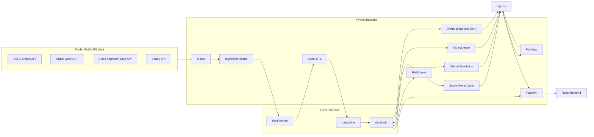
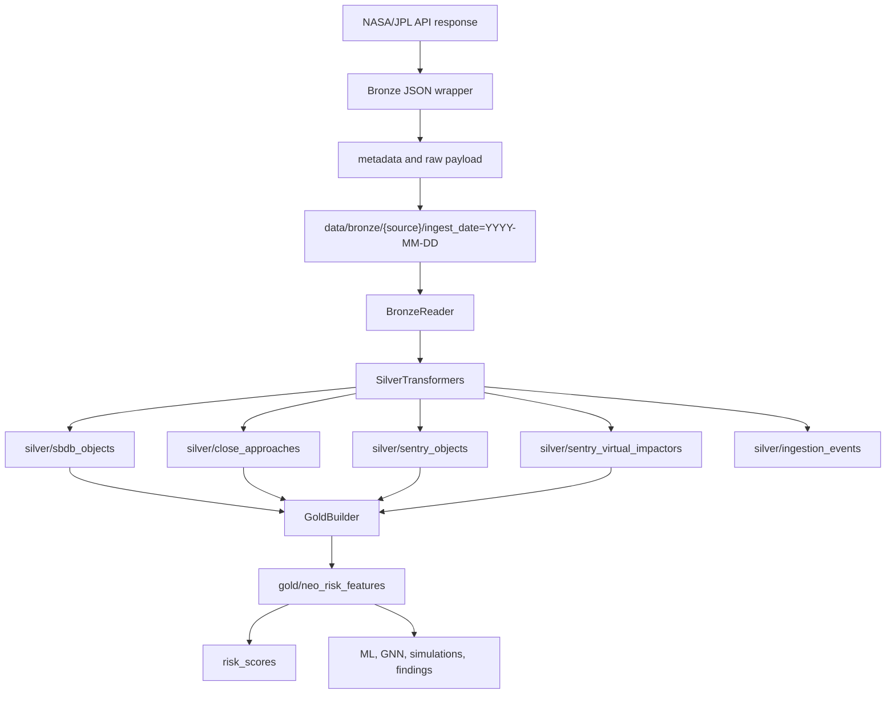
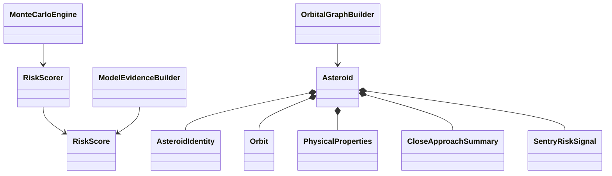
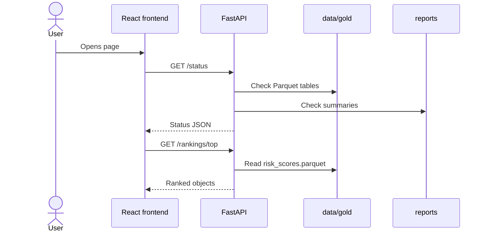

# Neo Angele Risk Lab

Neo Angele Risk Lab es un laboratorio de ingenieria de datos, analitica de riesgo experimental y visualizacion para estudiar objetos cercanos a la Tierra, o NEOs, usando datos publicos de NASA/JPL.

El proyecto descarga datos de APIs publicas, los conserva en una capa bronze, los normaliza con PySpark hacia silver, construye un dataset gold, calcula un Risk Priority Score explicable, genera rankings, ejecuta simulaciones Monte Carlo, construye un grafo orbital, produce evidencia secundaria con modelos de machine learning y expone resultados mediante FastAPI y un frontend React.

## Que problema atiende

Los datos sobre NEOs existen en fuentes publicas, pero suelen estar repartidos en APIs, formatos y tablas diferentes. Este proyecto organiza esas fuentes en un flujo reproducible para responder preguntas analiticas como:

- que objetos tienen mayor prioridad de revision dentro de este laboratorio;
- que variables explican esa prioridad;
- que tan estable es el score ante perturbaciones aproximadas;
- que objetos tienen vecindarios orbitales similares;
- donde coinciden o discrepan modelos de evidencia secundaria.

El sistema no predice impactos y no emite alertas oficiales. Su valor esta en la integracion tecnica, la trazabilidad de datos, la explicabilidad del score y la visualizacion educativa.

## Que es un NEO

Un NEO, Near-Earth Object, es un objeto pequeno del sistema solar cuya orbita lo acerca a la region orbital de la Tierra. En este proyecto se trabajan principalmente asteroides con campos como magnitud absoluta `h`, diametro, MOID, elementos orbitales, aproximaciones cercanas y senales de Sentry cuando estan disponibles.

## Que no pretende ser

Neo Angele Risk Lab no es un sistema oficial de alerta, no reemplaza NASA/JPL, CNEOS, Sentry ni analisis orbital profesional. El Risk Priority Score es una prioridad analitica experimental de 0 a 100 para ordenar revision dentro de este repositorio.

## Estado final del proyecto

Este checkout contiene las siguientes capacidades implementadas:

- Clientes para SBDB Object API, SBDB Query API, Close Approach Data API y Sentry API.
- Ingesta a `data/bronze` con metadata de fuente, parametros, objeto, firma de API y hora UTC.
- ETL bronze/silver/gold con PySpark y escritura Parquet.
- Dataset gold `data/gold/neo_risk_features`.
- Risk Priority Score y ranking en `data/gold/risk_scores`.
- Explicaciones por objeto y categorias `low`, `moderate`, `elevated`, `high`, `critical`.
- Score Simulation mediante Monte Carlo tabular.
- Orbital Simulation mediante clones orbitales aproximados.
- Grafo orbital kNN y laboratorio GNN.
- Evidencia de modelos, model cards, predicciones eval/full y desacuerdos.
- Hallazgos analiticos en `reports/findings`.
- API FastAPI.
- Frontend React/TypeScript/Vite.
- Docker Compose para levantar API y frontend.

## Arquitectura general

El diagrama fuente vive en [`docs/diagrams/system_architecture.mmd`](docs/diagrams/system_architecture.mmd).



## Flujo de datos bronze, silver y gold

El diagrama fuente vive en [`docs/diagrams/data_pipeline_bronze_silver_gold.mmd`](docs/diagrams/data_pipeline_bronze_silver_gold.mmd).



## Fuentes de datos usadas

| Fuente | Endpoint | Cliente | Uso principal |
| --- | --- | --- | --- |
| SBDB Object API | `https://ssd-api.jpl.nasa.gov/sbdb.api` | `src/neo_ange/clients/sbdb_object.py` | Datos ricos por objeto: identidad, fisica, orbita, aproximaciones y datos auxiliares. |
| SBDB Query API | `https://ssd-api.jpl.nasa.gov/sbdb_query.api` | `src/neo_ange/clients/sbdb_query.py` | Consultas tabulares y descubrimiento de objetos. |
| Close Approach Data API | `https://ssd-api.jpl.nasa.gov/cad.api` | `src/neo_ange/clients/close_approach.py` | Aproximaciones cercanas, distancia, velocidad y fecha. |
| Sentry API | `https://ssd-api.jpl.nasa.gov/sentry.api` | `src/neo_ange/clients/sentry.py` | Senales de riesgo Sentry, probabilidades, Palermo/Torino y virtual impactors cuando existen. |

No se requieren llaves privadas de API.

## Estructura de carpetas

| Ruta | Proposito |
| --- | --- |
| `src/neo_ange/clients` | Clientes HTTP para APIs NASA/JPL. |
| `src/neo_ange/pipelines` | Orquestacion de ingesta, ETL, ML, risk y simulaciones. |
| `src/neo_ange/services` | Resolucion y escritura de capas bronze, silver y gold. |
| `src/neo_ange/etl` | Lectura bronze, transformaciones silver, gold builder, calidad y writers. |
| `src/neo_ange/risk` | Score, categorias, ranking, explicaciones y reportes. |
| `src/neo_ange/simulation` | Monte Carlo del score. |
| `src/neo_ange/orbital_simulation` | Simulacion orbital aproximada por clones. |
| `src/neo_ange/ml` | Feature sets, baselines, metricas y auditoria de leakage. |
| `src/neo_ange/evidence` | Model evidence, model cards, predicciones y desacuerdos. |
| `src/neo_ange/gnn` | Grafo orbital, datasets, baselines, GraphSAGE/GCN opcionales y reportes. |
| `src/neo_ange/findings` | Hallazgos analiticos para API/frontend. |
| `src/neo_ange/api` | FastAPI, routers y schemas. |
| `frontend` | App React/TypeScript/Vite. |
| `data/bronze` | JSON crudo envuelto con metadata. |
| `data/silver` | Tablas Parquet normalizadas. |
| `data/gold` | Features, risk scores, simulaciones y grafo. |
| `reports` | Resumenes JSON/CSV/Markdown. |
| `artifacts` | Modelos, capturas y artefactos generados. |
| `docs` | Documentacion tecnica y diagramas. |
| `tests` | Pruebas unitarias y de integracion local. |

## Programacion orientada a objetos

El dominio principal esta en `src/neo_ange/domain`. Las clases convierten filas tabulares en conceptos legibles: `Asteroid`, `AsteroidIdentity`, `Orbit`, `PhysicalProperties`, `CloseApproachSummary`, `SentryRiskSignal`, `RiskScore`, `MonteCarloResult` y `OrbitalGraph`.



## Risk Priority Score

El ranking no lo construyen los modelos. El ranking se construye con `RiskScorer` en `src/neo_ange/risk/scoring.py`.

Formula general:

```text
R = sum(w_i * C_i)
R_100 = 100 * R
```

Donde `C_i` es cada componente normalizado en el rango `[0, 1]`, `w_i` es su peso y la suma de pesos es 1.

Pesos reales en `src/neo_ange/risk/schemas.py`:

| Componente | Peso |
| --- | ---: |
| `physical_risk_component` | 0.22 |
| `orbital_risk_component` | 0.25 |
| `approach_risk_component` | 0.18 |
| `sentry_risk_component` | 0.17 |
| `uncertainty_risk_component` | 0.13 |
| `data_quality_component` | 0.05 |

Componentes reales:

- `physical_risk_component`: diametro, `h`, `log_diameter`, `size_proxy_score`.
- `orbital_risk_component`: `moid`, `moid_ld`, `inverse_moid`, `q`, `e`, `i`.
- `approach_risk_component`: distancia minima, distancia minima nominal, velocidad relativa, conteo de aproximaciones e inverso de distancia.
- `sentry_risk_component`: `sentry_flag`, presencia Sentry, `sentry_ip`, Palermo acumulado/maximo, Torino maximo y numero de impactos virtuales.
- `uncertainty_risk_component`: `condition_code`, `rms`, arco de observacion, numero de observaciones y proxy de incertidumbre.
- `data_quality_component`: incompletitud de features, arco corto y bajo numero de observaciones.

Funciones auxiliares reales:

```text
bounded(x) = min(max(x, 0), 1)
weighted_available = promedio ponderado solo de senales disponibles
probability_signal(p) = bounded((log10(p) + 10) / 10)
palermo_signal(x) = bounded((x + 8) / 10)
```

Categorias reales en `src/neo_ange/risk/categories.py`:

| Categoria | Rango |
| --- | --- |
| `low` | `0 <= score < 20` |
| `moderate` | `20 <= score < 40` |
| `elevated` | `40 <= score < 60` |
| `high` | `60 <= score < 80` |
| `critical` | `score >= 80` |

## Simulaciones

### Score Simulation

La Score Simulation esta en `src/neo_ange/simulation`. Perturba variables tabulares que alimentan el Risk Priority Score y vuelve a calcular el score muchas veces. No propaga orbitas y no estima probabilidad oficial de impacto.

Variables perturbadas reales:

```text
diameter, h, moid, moid_ld,
min_close_approach_dist, min_close_approach_dist_min,
max_close_approach_v_rel,
sentry_ip, sentry_ps_cum,
condition_code, rms, arc_length, n_obs_used
```

Produce `base_score`, `mean_score`, `std_score`, `p05_score`, `median_score`, `p95_score`, `probability_score_above_60`, `probability_score_above_80` y `category_shift_probability`.

### Orbital Simulation

La Orbital Simulation esta en `src/neo_ange/orbital_simulation`. Genera clones orbitales aproximados desde elementos como `a`, `e`, `i`, `om`, `w`, `ma`, `n`, `per`, `moid`, `condition_code`, `arc_length`, `n_obs_used` y `rms`.

Usa una propagacion heliocentrica simplificada de dos cuerpos, resuelve Kepler con iteraciones de Newton, aproxima la Tierra como orbita circular de 1 AU y resume distancias Tierra-objeto.

Produce `baseline_min_distance_au`, media y percentiles de distancia minima simulada, dia de maxima cercania, `dispersion_index`, `orbital_uncertainty_score` y categorias `stable`, `variable`, `needs_review`, `uncertain`.

## Machine Learning y Model Evidence

Los modelos no definen el ranking. Los modelos aportan evidencia secundaria para revisar consistencia, desacuerdos y posibles patrones. El ranking principal viene del Risk Priority Score.

Modelos tabulares reales:

- `dummy_most_frequent`
- `logistic_regression`
- `random_forest`
- `hist_gradient_boosting`
- `rule_based_pha`

Baselines del laboratorio GNN:

- `logistic_regression`
- `random_forest`
- `mlp`
- `label_propagation`

Modelos GNN opcionales:

- `GraphSAGE`
- `GCN`

`torch` y `torch-geometric` son dependencias opcionales del extra `gnn`. `torchmetrics` no aparece como dependencia ni se usa para calcular metricas; las metricas se calculan con `scikit-learn` en `src/neo_ange/ml/metrics.py`.

Feature sets reales:

- `full_features`
- `definition_features_only`
- `no_definition_features`
- `orbital_only`
- `approach_and_quality`
- `sentry_related`
- `graph_node_features` en el laboratorio GNN.

El sistema separa predicciones de evaluacion y de inferencia completa:

- `reports/model_evidence/model_predictions_eval.parquet`
- `reports/model_evidence/model_predictions_full.parquet`

## Grafo orbital y GNN

El grafo orbital conecta objetos por similitud k-nearest neighbors sobre features numericas orbitales y de contexto. Se excluyen identificadores y target directo. El grafo se guarda en:

- `data/gold/gnn_graph/nodes.parquet`
- `data/gold/gnn_graph/edges.parquet`
- `reports/gnn/graph_summary.json`
- `reports/gnn/gnn_metrics.csv`

El diagrama fuente vive en [`docs/diagrams/gnn_orbital_graph_flow.mmd`](docs/diagrams/gnn_orbital_graph_flow.mmd).

## API y frontend

El backend esta en FastAPI y se importa como `neo_ange.api.main:app`. El frontend esta en `frontend`, usa React, TypeScript, Vite, TanStack Query, ECharts, Framer Motion, Lucide y Three.js.

Pantallas principales:

- Control Panel: estado general del sistema y telemetria.
- Risk Ranking: objetos ordenados por Risk Priority Score.
- Object Profile: perfil por objeto, componentes, evidencia y vecinos.
- Score Simulation: estabilidad del score bajo perturbacion tabular.
- Orbital Simulation: escenarios orbitales aproximados.
- Orbital Graph: grafo, vecinos y metricas GNN/baselines.
- Findings: hallazgos analiticos agregados.
- Methodology: metodologia y notas tecnicas.



Endpoints principales:

| Endpoint | Proposito |
| --- | --- |
| `GET /health` | Salud basica de API. |
| `GET /status` | Estado de datos, reportes y manifiestos. |
| `GET /objects` | Lista paginada de objetos. |
| `GET /objects/{object_key}` | Perfil tabular de un objeto. |
| `GET /rankings/top` | Ranking por Risk Priority Score. |
| `GET /rankings/summary` | Estadisticas del ranking. |
| `POST /risk/build` | Recalcula scores. |
| `GET /risk/explain/{object_key}` | Explicacion de score por objeto. |
| `POST /simulations/batch` | Score Monte Carlo por lote. |
| `GET /orbital-simulation/status` | Estado de simulacion orbital. |
| `POST /orbital-simulation/batch` | Simulacion orbital por lote. |
| `GET /gnn/status` | Estado de grafo y dependencias GNN. |
| `GET /gnn/graph` | Nodos y aristas del grafo. |
| `GET /findings/summary` | Hallazgos agregados. |
| `GET /model-evidence/summary` | Resumen de evidencia de modelos. |

## Resultados reales incluidos en este checkout

Estos numeros se leyeron de archivos existentes en este repositorio. Cuando los reportes no coinciden entre si, se documenta la diferencia en la tabla.

| Artefacto | Resultado observado |
| --- | --- |
| `data/gold/neo_risk_features` | 1,000 filas; 280 `pha=true`; 720 `pha=false`. |
| `data/gold/risk_scores/risk_scores.parquet` | 1,000 filas; `low=70`, `moderate=909`, `elevated=21`. |
| `reports/risk/risk_scores_summary.json` | Score min 14.389905; media 28.766260; mediana 29.164740; max 47.271572. |
| Top object del risk summary | `20152637`, `152637 (1997 NC1)`, score 47.271572, categoria `elevated`. |
| `data/gold/simulation_results/monte_carlo_results.parquet` | 21 filas de Score Simulation. |
| `reports/simulation/monte_carlo_summary.json` | `n_result_rows=21`, version `monte-carlo-v0.1.0`. |
| `data/gold/orbital_simulation/orbital_monte_carlo_results.parquet` | 50 filas; `stable=16`, `variable=21`, `needs_review=8`, `uncertain=5`. |
| `reports/orbital_simulation/orbital_simulation_summary.json` | Min p05 distance 0.020102 AU; dispersion media 0.617105. |
| `data/gold/gnn_graph/nodes.parquet` | 1,000 nodos. |
| `data/gold/gnn_graph/edges.parquet` | 6,955 aristas. |
| `reports/gnn/graph_summary.json` | Densidad 0.0139239; estado `success`. |
| `reports/gnn/gnn_metrics.csv` | 14 filas de metricas; GraphSAGE y GCN figuran como `skipped_missing_dependency` en este CSV. |
| `reports/model_evidence/model_evidence_summary.json` | Reporta 20,000 predicciones full, 5,000 eval, coverage 1.0, 1,367 desacuerdos y mejor evidencia GraphSAGE; este reporte corresponde a una corrida de 4,000 objetos y no coincide con los Parquet actuales de 1,000 objetos. |
| `reports/findings/findings_summary.json` | Tambien refleja una corrida de 4,000 objetos; debe regenerarse si se desea alinear con el estado actual de `data/gold`. |

Limitacion importante: este checkout contiene artefactos de diferentes corridas. Para un cierre completamente coherente, ejecuta la regeneracion completa y luego `model-evidence build` y `findings build`.

## Correr con Docker

```bash
docker compose up -d --build
```

URLs locales:

```text
API: http://127.0.0.1:8000
Frontend: http://127.0.0.1:5174
```

Validar:

```bash
curl http://127.0.0.1:8000/health
curl http://127.0.0.1:8000/status
curl http://127.0.0.1:8000/findings/summary
curl http://127.0.0.1:8000/model-evidence/summary
curl http://127.0.0.1:8000/orbital-simulation/status
```

## Regenerar dataset y reportes

Este flujo puede tardar de una a varias horas segun maquina, red y dependencias.

```bash
docker compose exec app python -m neo_ange.cli expand max --target 4000 --skip-existing --resume
docker compose exec app python -m neo_ange.cli etl run-all
docker compose exec app python -m neo_ange.cli risk build
docker compose exec app python -m neo_ange.cli simulate batch --limit 100 --n-simulations 500
docker compose exec app python -m neo_ange.cli orbital-sim batch --limit 50 --n-clones 300 --horizon-days 3650 --time-step-days 10
docker compose exec app python -m neo_ange.cli ml run-all --target pha
docker compose exec app python -m neo_ange.cli gnn build-graph --k 10 --min-nodes 100
docker compose exec app python -m neo_ange.cli gnn run --target pha --k 10 --min-nodes 100
docker compose exec app python -m neo_ange.cli model-evidence build
docker compose exec app python -m neo_ange.cli findings build
```

## Validacion de desarrollo

```bash
python -m pytest
python -m ruff check .
python -m black --check .
```

## Documento metodologico

La memoria tecnica esta en:

- [`docs/methodology/neo_ange_methodology.tex`](docs/methodology/neo_ange_methodology.tex)
- [`docs/methodology/build_pdf.md`](docs/methodology/build_pdf.md)
- [`docs/methodology/README.md`](docs/methodology/README.md)

Si tienes LaTeX instalado:

```bash
cd docs/methodology
pdflatex neo_ange_methodology.tex
```

Tambien existe el script opcional:

```bash
bash scripts/build_methodology_pdf.sh
```

## Diagramas

Los diagramas Mermaid creados para esta documentacion estan en:

- [`docs/diagrams/system_architecture.mmd`](docs/diagrams/system_architecture.mmd)
- [`docs/diagrams/data_pipeline_bronze_silver_gold.mmd`](docs/diagrams/data_pipeline_bronze_silver_gold.mmd)
- [`docs/diagrams/class_diagram_domain.mmd`](docs/diagrams/class_diagram_domain.mmd)
- [`docs/diagrams/risk_scoring_flow.mmd`](docs/diagrams/risk_scoring_flow.mmd)
- [`docs/diagrams/ml_model_evidence_flow.mmd`](docs/diagrams/ml_model_evidence_flow.mmd)
- [`docs/diagrams/gnn_orbital_graph_flow.mmd`](docs/diagrams/gnn_orbital_graph_flow.mmd)
- [`docs/diagrams/score_monte_carlo_flow.mmd`](docs/diagrams/score_monte_carlo_flow.mmd)
- [`docs/diagrams/orbital_simulation_flow.mmd`](docs/diagrams/orbital_simulation_flow.mmd)
- [`docs/diagrams/api_frontend_sequence.mmd`](docs/diagrams/api_frontend_sequence.mmd)
- [`docs/diagrams/final_app_navigation.mmd`](docs/diagrams/final_app_navigation.mmd)

## Limitaciones honestas

- El score es experimental y educativo.
- Sentry ausente no significa riesgo cero; significa que no hay senal Sentry disponible en esa fila.
- La simulacion orbital es aproximada y no sustituye propagacion profesional.
- Los modelos pueden aprender definiciones de PHA cuando usan `h`, `moid`, diametro o proxies cercanos.
- Algunos reportes de este checkout pertenecen a corridas distintas y deben regenerarse para una foto final unica.
- La cobertura de datos depende de disponibilidad de las APIs publicas y de la ejecucion local.

## Roadmap minimo opcional

- Publicar un despliegue estable de solo lectura.
- Regenerar todos los artefactos desde cero en una sola corrida auditada.
- Mejorar performance del frontend para grafos grandes.
- Agregar documentacion equivalente en ingles.

## Guía de instalación desde cero

Esta guia es practica y copiable. No asume que ya tengas Git, Docker o Docker Compose.

### Instalación en Linux Ubuntu/Debian/Linux Mint

#### 1. Actualizar paquetes

```bash
sudo apt update
sudo apt upgrade -y
```

#### 2. Instalar Git, curl y dependencias básicas

```bash
sudo apt install -y git curl ca-certificates gnupg lsb-release
```

#### 3. Instalar Docker

```bash
sudo install -m 0755 -d /etc/apt/keyrings
curl -fsSL https://download.docker.com/linux/ubuntu/gpg | sudo gpg --dearmor -o /etc/apt/keyrings/docker.gpg
sudo chmod a+r /etc/apt/keyrings/docker.gpg
```

Agregar repositorio Docker:

```bash
echo \
  "deb [arch=$(dpkg --print-architecture) signed-by=/etc/apt/keyrings/docker.gpg] https://download.docker.com/linux/ubuntu \
  $(. /etc/os-release && echo "$VERSION_CODENAME") stable" | \
  sudo tee /etc/apt/sources.list.d/docker.list > /dev/null
```

Instalar Docker:

```bash
sudo apt update
sudo apt install -y docker-ce docker-ce-cli containerd.io docker-buildx-plugin docker-compose-plugin
```

#### 4. Permitir usar Docker sin sudo

```bash
sudo usermod -aG docker $USER
```

Cierra sesión y vuelve a entrar, o reinicia la computadora, para que el cambio del grupo `docker` tenga efecto.

Comando alternativo temporal:

```bash
newgrp docker
```

#### 5. Validar Docker

```bash
docker --version
docker compose version
docker run hello-world
```

#### 6. Clonar el repositorio

```bash
git clone https://github.com/LiamSalazar/NEO-Angele-Risk-Lab.git
cd NEO-Angele-Risk-Lab
```

#### 7. Levantar la aplicación

```bash
docker compose up -d --build
```

#### 8. Validar que los contenedores están corriendo

```bash
docker compose ps
```

Deben verse servicios parecidos a:

```text
neo_ange_api        Up
neo_ange_frontend   Up
```

#### 9. Validar API

```bash
curl http://127.0.0.1:8000/health
curl http://127.0.0.1:8000/status
```

#### 10. Abrir la aplicación

Abre tu navegador y escribe en la barra de direcciones:

```text
http://127.0.0.1:5174
```

Esa es la interfaz web del proyecto.

### Regenerar dataset, modelos, simulaciones y hallazgos

Este paso puede tardar de una a varias horas, dependiendo de la computadora y la conexión a internet.

```bash
docker compose exec app python -m neo_ange.cli expand max --target 4000 --skip-existing --resume
docker compose exec app python -m neo_ange.cli etl run-all
docker compose exec app python -m neo_ange.cli risk build
docker compose exec app python -m neo_ange.cli simulate batch --limit 100 --n-simulations 500
docker compose exec app python -m neo_ange.cli orbital-sim batch --limit 50 --n-clones 300 --horizon-days 3650 --time-step-days 10
docker compose exec app python -m neo_ange.cli ml run-all --target pha
docker compose exec app python -m neo_ange.cli gnn build-graph --k 10 --min-nodes 100
docker compose exec app python -m neo_ange.cli gnn run --target pha --k 10 --min-nodes 100
docker compose exec app python -m neo_ange.cli model-evidence build
docker compose exec app python -m neo_ange.cli findings build
```

#### 12. Validar resultados generados

```bash
curl http://127.0.0.1:8000/findings/summary
curl http://127.0.0.1:8000/model-evidence/summary
curl http://127.0.0.1:8000/orbital-simulation/status
curl http://127.0.0.1:8000/gnn/status
```

#### 13. Apagar la app

```bash
docker compose down
```

#### 14. Volver a prenderla después

```bash
cd NEO-Angele-Risk-Lab
docker compose up -d
```

Abrir nuevamente:

```text
http://127.0.0.1:5174
```

### Instalación en macOS

En macOS se recomienda usar Homebrew y Docker Desktop.

#### 1. Instalar Homebrew si no existe

```bash
/bin/bash -c "$(curl -fsSL https://raw.githubusercontent.com/Homebrew/install/HEAD/install.sh)"
```

#### 2. Instalar Git

```bash
brew install git
```

#### 3. Instalar Docker Desktop

```bash
brew install --cask docker
```

Después de instalar Docker Desktop, abre la aplicación Docker desde Launchpad o Applications y espera a que aparezca como “running”.

#### 4. Validar Docker

```bash
docker --version
docker compose version
```

#### 5. Clonar el repositorio

```bash
git clone https://github.com/LiamSalazar/NEO-Angele-Risk-Lab.git
cd NEO-Angele-Risk-Lab
```

#### 6. Levantar la aplicación

```bash
docker compose up -d --build
```

#### 7. Validar servicios

```bash
docker compose ps
```

#### 8. Validar API

```bash
curl http://127.0.0.1:8000/health
curl http://127.0.0.1:8000/status
```

#### 9. Abrir la interfaz

Abre Safari, Chrome o Firefox y escribe:

```text
http://127.0.0.1:5174
```

#### 10. Regenerar datos

```bash
docker compose exec app python -m neo_ange.cli expand max --target 4000 --skip-existing --resume
docker compose exec app python -m neo_ange.cli etl run-all
docker compose exec app python -m neo_ange.cli risk build
docker compose exec app python -m neo_ange.cli simulate batch --limit 100 --n-simulations 500
docker compose exec app python -m neo_ange.cli orbital-sim batch --limit 50 --n-clones 300 --horizon-days 3650 --time-step-days 10
docker compose exec app python -m neo_ange.cli ml run-all --target pha
docker compose exec app python -m neo_ange.cli gnn build-graph --k 10 --min-nodes 100
docker compose exec app python -m neo_ange.cli gnn run --target pha --k 10 --min-nodes 100
docker compose exec app python -m neo_ange.cli model-evidence build
docker compose exec app python -m neo_ange.cli findings build
```

#### 11. Apagar la app

```bash
docker compose down
```

### Problemas comunes

#### Docker no está iniciado

```text
Error: Cannot connect to the Docker daemon
```

En Linux:

```bash
sudo systemctl start docker
sudo systemctl enable docker
```

En macOS: abre Docker Desktop.

#### Puerto ocupado

Si el puerto 5174 o 8000 está ocupado:

```bash
docker compose down
docker compose up -d
```

Si persiste:

```bash
sudo lsof -i :5174
sudo lsof -i :8000
```

#### Permiso denegado en Docker

```text
permission denied while trying to connect to the Docker daemon
```

Solución:

```bash
sudo usermod -aG docker $USER
newgrp docker
```

#### La app abre pero muestra pocos datos

Regenera los datos:

```bash
docker compose exec app python -m neo_ange.cli expand max --target 4000 --skip-existing --resume
docker compose exec app python -m neo_ange.cli etl run-all
docker compose exec app python -m neo_ange.cli risk build
docker compose exec app python -m neo_ange.cli model-evidence build
docker compose exec app python -m neo_ange.cli findings build
```

#### El frontend no carga

```bash
docker compose ps
curl -I http://127.0.0.1:5174
```

#### La API no responde

```bash
docker compose logs app --tail=100
```

#### El frontend no refleja cambios

```text
Recarga con Ctrl + Shift + R.
```

En macOS:

```text
Command + Shift + R.
```

Si todo salió correctamente, la aplicación estará disponible en:

```text
http://127.0.0.1:5174
```
