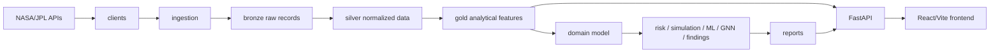
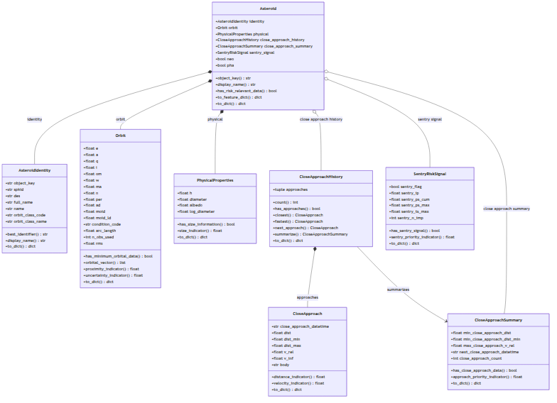

# Neo Angele Risk Lab

Neo Angele Risk Lab is an analytical platform for Near-Earth Objects (NEOs). It uses public NASA/JPL data, builds a reproducible bronze/silver/gold pipeline, calculates an experimental Risk Priority Score, runs score and orbital simulations, builds secondary ML/GNN evidence, exposes results through FastAPI and a React/Vite frontend, and runs locally with Docker Compose.

It is not an official warning system. It does not replace NASA/JPL, CNEOS, Sentry, or professional orbit-determination workflows. The central ranking in this project is the Risk Priority Score; ML, GNN, simulations, and findings are supporting evidence for review and explanation.

## Table of Contents

1. [Project overview](#project-overview)
2. [What the project analyzes](#what-the-project-analyzes)
3. [Data sources](#data-sources)
4. [Architecture](#architecture)
5. [Data pipeline: bronze, silver and gold](#data-pipeline-bronze-silver-and-gold)
6. [Object-oriented domain model](#object-oriented-domain-model)
7. [Risk Priority Score](#risk-priority-score)
8. [Score simulation](#score-simulation)
9. [Orbital simulation](#orbital-simulation)
10. [Machine learning evidence](#machine-learning-evidence)
11. [Orbital graph and GNN](#orbital-graph-and-gnn)
12. [Findings and reports](#findings-and-reports)
13. [API and frontend](#api-and-frontend)
14. [Repository structure](#repository-structure)
15. [Current results](#current-results)
16. [How to run](#how-to-run)
17. [How to regenerate outputs](#how-to-regenerate-outputs)
18. [Validation](#validation)
19. [Limitations](#limitations)
20. [Documentation map](#documentation-map)

## Project overview

Public NEO data is distributed across several NASA/JPL APIs with different shapes: object-level JSON, tabular discovery queries, close-approach rows, and Sentry monitoring records. This project turns those sources into a local analytical system that can answer:

- which objects have the highest experimental review priority in this lab;
- which score components drive that priority;
- whether a score is stable under approximate input perturbations;
- how an object's orbital neighborhood compares with other objects;
- where ML/GNN models agree or disagree with the tabular labels used for secondary evidence;
- which findings are worth surfacing in reports and the frontend.

The project is built as an engineering and portfolio-ready analytics system: ingestion, ETL, scoring, simulation, graph construction, reports, API, frontend, tests, and Docker are all part of the deliverable.

## What the project analyzes

A NEO, or Near-Earth Object, is a small Solar System object whose orbit brings it close to Earth's orbital region. This repository focuses on NEO asteroid records and related public NASA/JPL fields.

Core domain terms:

| Term | Meaning in this project |
| --- | --- |
| `NEO` | Near-Earth Object. The `neo` field is a boolean signal from NASA/JPL records when available. |
| `PHA` | Potentially Hazardous Asteroid label from source data. It is used as an ML/GNN target, not as the Risk Priority Score itself. |
| `Sentry` | NASA/JPL impact-monitoring data source for objects with monitored impact solutions. Sentry sparsity is expected; most objects have no Sentry signal. |
| `MOID` | Minimum Orbit Intersection Distance. Lower values can raise orbital proximity signals in this lab's score. |
| `H` or absolute magnitude | Brightness-based proxy related to object size. Lower `h` usually indicates a larger object, but it is not a direct diameter measurement. |
| Close approach | A recorded approach event with date, distance, velocity, and body when CAD data is available. |
| Risk Priority Score | Experimental 0-100 review-priority score calculated by this repo. It is explainable and reproducible, but not an official impact probability. |
| Simulation | In this repo, score simulation means perturbing score inputs; orbital simulation means approximate clone propagation with a two-body Kepler model. |
| GNN | Graph neural network experiment over an orbital similarity graph. It is secondary evidence, not the ranking source. |

## Data sources

The data sources are public NASA/JPL SSD APIs. No private API key is required.

| Source | Endpoint | Client | What it contributes | Main fields used | Limitations |
| --- | --- | --- | --- | --- | --- |
| NASA/JPL SBDB Object API | `https://ssd-api.jpl.nasa.gov/sbdb.api` | `src/neo_ange/clients/sbdb_object.py` | Rich per-object payloads: identity, orbit, physical parameters, orbit class, and covariance payloads when available. | `spkid`, `des`, `fullname`, `name`, `neo`, `pha`, `orbit_class`, `h`, `diameter`, `albedo`, `e`, `a`, `q`, `i`, `om`, `w`, `ma`, `n`, `per`, `ad`, `moid`, `moid_ld`, `condition_code`, `data_arc`, `n_obs_used`, `rms`, covariance fields. | Object-level JSON is heterogeneous. Some objects lack diameter, albedo, covariance, or observation-quality fields. |
| NASA/JPL SBDB Query API | `https://ssd-api.jpl.nasa.gov/sbdb_query.api` | `src/neo_ange/clients/sbdb_query.py` | Bulk query and discovery of NEO-like objects for expansion workflows. | Query fields selected by the client, object designations, counts, and tabular rows. | Field availability depends on query configuration; detailed object data still comes from SBDB Object calls. |
| NASA/JPL Close Approach Data API | `https://ssd-api.jpl.nasa.gov/cad.api` | `src/neo_ange/clients/close_approach.py` | Close approach records and event-level context. | `des`, `fullname`, `cd`, `dist`, `dist_min`, `dist_max`, `v_rel`, `v_inf`, `body`, `h`, `diameter`. | CAD coverage is not uniform across all locally ingested objects. Gold scoring uses aggregated close-approach fields for efficiency. |
| NASA/JPL Sentry API | `https://ssd-api.jpl.nasa.gov/sentry.api` | `src/neo_ange/clients/sentry.py` | Monitored impact signals when an object appears in Sentry data. | `des`, `spk`, `fullname`, `ip`, `ps_cum`, `ps_max`, `ts_max`, `n_imp`, virtual impactor rows. | Sparse by design. Absence of Sentry data does not mean "no risk"; it means no Sentry signal was present in the current local dataset. |

The source configuration lives in `configs/datasources.yaml`. Ingestion preserves source metadata and request context in bronze files so the path from API response to analytical output remains traceable.

## Architecture

The architecture is layered:

```text
NASA/JPL APIs
-> clients
-> ingestion
-> bronze raw records
-> silver normalized data
-> gold analytical features
-> domain model
-> analytical services
-> reports / API / frontend
```

Responsibilities:

| Layer | Responsibility | Main paths |
| --- | --- | --- |
| Clients | Connect to NASA/JPL APIs and return source payloads. | `src/neo_ange/clients/` |
| Ingestion | Download source data and persist wrapped raw records. | `src/neo_ange/pipelines/ingestion.py`, `data/bronze/` |
| Bronze | Preserve raw payloads, metadata, query parameters, object id, API signature, and ingest timestamp. | `data/bronze/` |
| Silver | Normalize source-specific JSON and tables into typed Parquet tables. | `src/neo_ange/etl/silver_transformers.py`, `data/silver/` |
| Gold | Build analytical features for score, simulations, ML, GNN, API, and reports. | `src/neo_ange/etl/gold_builder.py`, `data/gold/neo_risk_features` |
| Domain | Convert processed rows into NEO domain objects. | `src/neo_ange/domain/` |
| Risk/Simulation/ML/GNN/Findings | Run analytical workflows and write reproducible outputs. | `src/neo_ange/risk/`, `src/neo_ange/simulation/`, `src/neo_ange/orbital_simulation/`, `src/neo_ange/ml/`, `src/neo_ange/gnn/`, `src/neo_ange/evidence/`, `src/neo_ange/findings/` |
| API | Serve rankings, objects, simulations, graph, evidence, and findings. | `src/neo_ange/api/` |
| Frontend | Visualize mission control, ranking, object profiles, labs, graph evidence, and findings. | `frontend/src/` |
| Reports | Persist JSON, CSV, Markdown, and Parquet evidence. | `reports/`, `artifacts/` |

Source diagram: [`docs/diagrams/system_architecture.mmd`](docs/diagrams/system_architecture.mmd)


```mermaid
flowchart LR
    APIs["NASA/JPL APIs"] --> Clients["clients"]
    Clients --> Ingestion["ingestion"]
    Ingestion --> Bronze["bronze raw records"]
    Bronze --> Silver["silver normalized data"]
    Silver --> Gold["gold analytical features"]
    Gold --> Domain["domain model"]
    Domain --> Services["risk / simulation / ML / GNN / findings"]
    Services --> Reports["reports"]
    Gold --> API["FastAPI"]
    Reports --> API
    API --> Frontend["React/Vite frontend"]
```

## Data pipeline: bronze, silver and gold

Source diagram: [`docs/diagrams/data_pipeline_bronze_silver_gold.mmd`](docs/diagrams/data_pipeline_bronze_silver_gold.mmd)

### Bronze

Bronze is the traceability layer. It stores JSON wrappers under source-specific directories:

- `data/bronze/sbdb_object/`
- `data/bronze/sbdb_query/`
- `data/bronze/cad/`
- `data/bronze/sentry/`

Each bronze file preserves the raw API payload plus metadata such as source, object id, query parameters, API signature version, UTC ingest time, and partition path. `src/neo_ange/etl/bronze_reader.py` reads these date-partitioned wrappers and keeps file-path lineage.

Bronze exists so the project can re-run transformations without re-calling NASA/JPL, audit how a row was built, and compare source payloads against later silver/gold outputs.

### Silver

Silver normalizes raw payloads into typed Parquet tables:

- `data/silver/sbdb_objects`
- `data/silver/close_approaches`
- `data/silver/sentry_objects`
- `data/silver/sentry_virtual_impactors`
- `data/silver/ingestion_events`

The transformations live in `src/neo_ange/etl/silver_transformers.py`. They flatten nested JSON, coerce booleans and numeric fields, extract orbit and physical parameters, preserve `raw_json`, and standardize CAD/Sentry columns. Examples:

- SBDB object payloads become one row per object with identity, orbit, physical properties, covariance metadata, and observation-quality fields.
- CAD payloads become close-approach rows with date, distance, velocity, body, and source metadata.
- Sentry payloads become monitored-object and virtual-impactor rows with impact probability and Palermo/Torino scale fields.
- Ingestion events preserve operational lineage.

### Gold

Gold builds the analytical table used by the rest of the project:

- `data/gold/neo_risk_features`
- `data/gold/risk_scores/risk_scores.parquet`
- `data/gold/simulation_results/monte_carlo_results.parquet`
- `data/gold/simulation_results/score_uncertainty_results.parquet`
- `data/gold/orbital_simulation/orbital_monte_carlo_results.parquet`
- `data/gold/gnn_graph/nodes.parquet`
- `data/gold/gnn_graph/edges.parquet`

`src/neo_ange/etl/gold_builder.py` joins silver sources and creates final features. Main gold columns include identity (`object_key`, `spkid`, `des`, `full_name`, `name`), flags (`neo`, `pha`, `sentry_flag`), orbit (`e`, `a`, `q`, `i`, `om`, `w`, `ma`, `n`, `per`, `ad`, `moid`, `moid_ld`), physical properties (`h`, `diameter`, `albedo`, `log_diameter`), close-approach aggregates (`min_close_approach_dist`, `min_close_approach_dist_min`, `max_close_approach_v_rel`, `next_close_approach_datetime`, `close_approach_count`), Sentry aggregates (`sentry_ip`, `sentry_ps_cum`, `sentry_ps_max`, `sentry_ts_max`, `sentry_n_imp`), quality and derived features (`inverse_moid`, `inverse_min_distance`, `relative_velocity_score`, `observation_quality_score`, `uncertainty_proxy_score`, `size_proxy_score`, `proximity_proxy_score`, `sentry_presence_score`, `feature_completeness_ratio`).

Gold connects directly to:

- risk scoring in `src/neo_ange/risk/`;
- score simulation in `src/neo_ange/simulation/`;
- orbital simulation in `src/neo_ange/orbital_simulation/`;
- ML baselines in `src/neo_ange/ml/`;
- model evidence in `src/neo_ange/evidence/`;
- graph/GNN workflows in `src/neo_ange/gnn/`;
- API/domain object construction in `src/neo_ange/domain/`;
- findings in `src/neo_ange/findings/`.

## Object-oriented domain model

The object-oriented model is not a CSV split into classes. NASA/JPL gives heterogeneous JSON and tabular data. The pipeline first normalizes source records into silver and gold. After that, `AsteroidFactory` in `src/neo_ange/domain/factories.py` converts analytical rows into domain objects.

The abstraction comes from real NEO concepts:

- `Asteroid` is the aggregate root for one object.
- `AsteroidIdentity` owns identifiers and display rules.
- `Orbit` owns orbital elements and observation-quality signals.
- `PhysicalProperties` owns magnitude, diameter, albedo, and size signals.
- `CloseApproach` models one close-approach event.
- `CloseApproachHistory` models the one-to-many relationship between one object and many approaches.
- `CloseApproachSummary` keeps the stable aggregate view used by scoring, API, reports, and frontend.
- `SentryRiskSignal` models optional Sentry impact-monitoring evidence.

`Asteroid` and `AsteroidIdentity` are separate because one object can be identified by several fields: `spkid`, `des`, `full_name`, `name`, and `object_key`. `AsteroidIdentity.best_identifier()` and `display_name()` concentrate those lookup and display rules instead of spreading them across scoring, API, and frontend code.

`CloseApproachHistory` and `CloseApproachSummary` coexist because they serve different contracts. `CloseApproachHistory` represents the real one-to-many CAD relationship when detailed rows are available. `CloseApproachSummary` is the stable view already consumed by risk scoring, reports, API responses, and frontend panels. If gold only has aggregates, the history can be absent without breaking `Asteroid`; if detailed records exist, `CloseApproachHistory.summarize()` can derive the summary.

Pure domain class diagram:



Source: [`docs/diagrams/class_diagram_entities.mmd`](docs/diagrams/class_diagram_entities.mmd)

Additional UML documentation:

- [System class diagram](docs/diagrams/class_diagram_system.mmd)
- [Domain contracts diagram](docs/diagrams/class_diagram_domain_contracts.mmd)
- [Object-oriented design notes](docs/object_oriented_design.md)

### Domain attributes

| Class | Main attributes | Meaning |
| --- | --- | --- |
| `Asteroid` | `identity`, `orbit`, `physical`, `close_approach_history`, `close_approach_summary`, `sentry_signal`, `neo`, `pha` | Aggregate composition and source flags for one NEO. |
| `AsteroidIdentity` | `object_key`, `spkid`, `des`, `full_name`, `name`, `orbit_class_code`, `orbit_class_name` | Stable keys, human-readable labels, and orbit class metadata. |
| `Orbit` | `e`, `a`, `q`, `i`, `om`, `w`, `ma`, `n`, `per`, `ad`, `moid`, `moid_ld`, `condition_code`, `arc_length`, `n_obs_used`, `rms` | Orbital geometry and observation-quality metadata. |
| `PhysicalProperties` | `h`, `diameter`, `albedo`, `log_diameter` | Size and brightness fields used directly or as proxies. |
| `CloseApproach` | `close_approach_datetime`, `dist`, `dist_min`, `dist_max`, `v_rel`, `v_inf`, `body` | One CAD event. |
| `CloseApproachHistory` | `approaches` | Tuple of `CloseApproach` records for one object. |
| `CloseApproachSummary` | `min_close_approach_dist`, `min_close_approach_dist_min`, `max_close_approach_v_rel`, `next_close_approach_datetime`, `close_approach_count` | Aggregate CAD fields used by scoring and presentation. |
| `SentryRiskSignal` | `sentry_flag`, `sentry_ip`, `sentry_ps_cum`, `sentry_ps_max`, `sentry_ts_max`, `sentry_n_imp` | Optional Sentry monitoring signals. |

### Domain methods

| Method | Where | What it does |
| --- | --- | --- |
| `object_key()` | `Asteroid` | Delegates to `identity.best_identifier()` and returns the stable lookup key. |
| `display_name()` | `Asteroid`, `AsteroidIdentity` | Chooses the most useful human-readable label from name, full name, designation, SPK id, or object key. |
| `has_risk_relevant_data()` | `Asteroid` | Checks whether orbit, physical, approach, Sentry, `neo`, or `pha` data is present. |
| `to_feature_dict()` | `Asteroid` | Flattens nested domain objects back into model/scoring-friendly features and adds domain indicators. |
| `to_dict()` | All pure entities | Serializes the nested domain representation. |
| `best_identifier()` | `AsteroidIdentity` | Picks the first available stable identifier in priority order. |
| `has_minimum_orbital_data()` | `Orbit` | Requires `e`, `a`, `q`, and `i` to be numeric before comparing orbital geometry. |
| `orbital_vector()` | `Orbit` | Exports a fixed-width numeric vector for graph/model features, filling missing values with zero. |
| `proximity_indicator()` | `Orbit` | Computes a bounded inverse-distance signal from `moid` or `moid_ld`. |
| `uncertainty_indicator()` | `Orbit` | Combines condition code, RMS, observation arc, and observation count into a bounded uncertainty proxy. |
| `has_size_information()` | `PhysicalProperties` | Checks whether `h`, `diameter`, or `albedo` exists. |
| `size_indicator()` | `PhysicalProperties` | Uses diameter, log diameter, or `h` to return a bounded size signal. |
| `distance_indicator()` | `CloseApproach` | Uses the closest available distance and converts it to a bounded inverse-distance signal. |
| `velocity_indicator()` | `CloseApproach` | Uses relative or asymptotic velocity and bounds it against 50 km/s. |
| `count()` / `has_approaches()` | `CloseApproachHistory` | Counts and checks detailed close-approach records. |
| `closest()` / `fastest()` / `next_approach()` | `CloseApproachHistory` | Selects the closest distance, highest velocity, and earliest comparable date. |
| `summarize()` | `CloseApproachHistory` | Builds a `CloseApproachSummary` from detailed records. |
| `has_close_approach_data()` | `CloseApproachSummary` | Checks whether any aggregate CAD field is present. |
| `approach_priority_indicator()` | `CloseApproachSummary` | Combines distance, velocity, and count into a bounded approach signal. |
| `has_sentry_signal()` | `SentryRiskSignal` | Checks explicit Sentry flag or available Sentry metrics. |
| `sentry_priority_indicator()` | `SentryRiskSignal` | Combines impact probability, Palermo/Torino scales, flag, and impact count into a bounded signal. |

Domain is different from process and infrastructure. Domain classes describe NEO concepts. Process classes coordinate scoring, simulations, evidence, graph building, and findings. Infrastructure classes read APIs, Parquet, reports, and FastAPI requests.

## Risk Priority Score

The Risk Priority Score is the primary ranking mechanism. It is implemented in:

- `src/neo_ange/risk/scoring.py`
- `src/neo_ange/risk/schemas.py`
- `src/neo_ange/risk/categories.py`
- `src/neo_ange/pipelines/risk.py`

Outputs:

- `data/gold/risk_scores/risk_scores.parquet`
- `reports/risk/risk_scores_summary.json`
- `reports/risk/top_risk_objects.csv`
- `reports/risk/risk_methodology.md`
- `reports/risk/risk_score_methodology_detailed.md`
- `reports/risk/risk_component_sensitivity.csv`
- `reports/risk/risk_ablation_summary.json`

The formula is:

```text
risk_score = sum(component_i * weight_i)
risk_score_0_100 = 100 * risk_score
```

Weights from `src/neo_ange/risk/schemas.py`:

| Component | Weight | Main signals |
| --- | ---: | --- |
| `physical_risk_component` | 0.22 | `diameter`, `h`, `log_diameter`, `size_proxy_score` |
| `orbital_risk_component` | 0.25 | `moid`, `moid_ld`, `inverse_moid`, `q`, `e`, `i` |
| `approach_risk_component` | 0.18 | close-approach distance, velocity, count, inverse distance |
| `sentry_risk_component` | 0.17 | Sentry flag, impact probability, Palermo/Torino scales, virtual impact count |
| `uncertainty_risk_component` | 0.13 | condition code, RMS, observation arc, observation count, uncertainty proxy |
| `data_quality_component` | 0.05 | feature incompleteness, short arc, low observation count |

Categories from `src/neo_ange/risk/categories.py`:

| Category | Score range |
| --- | --- |
| `low` | 0 to less than 20 |
| `moderate` | 20 to less than 40 |
| `elevated` | 40 to less than 60 |
| `high` | 60 to less than 80 |
| `critical` | 80 to 100 |

The score is experimental, explainable, and designed for review prioritization inside this repository. It is not a calibrated official impact probability. Component weights are transparent engineering choices, not a scientific claim of calibrated hazard risk.

## Score simulation

Score simulation answers: if available score inputs are perturbed within reported, empirical, or heuristic uncertainty ranges, how stable is the Risk Priority Score?

Implementation:

- `src/neo_ange/simulation/monte_carlo.py`
- `src/neo_ange/simulation/uncertainty.py`
- `src/neo_ange/simulation/perturbation.py`
- `src/neo_ange/simulation/sensitivity.py`
- `src/neo_ange/pipelines/simulation.py`

Outputs:

- `data/gold/simulation_results/monte_carlo_results.parquet`
- `data/gold/simulation_results/score_uncertainty_results.parquet`
- `reports/simulation/monte_carlo_summary.json`
- `reports/simulation/score_uncertainty_summary.json`
- `reports/simulation/score_sensitivity_summary.json`
- `reports/simulation/score_sensitivity_by_variable.csv`

The simulation samples base score variables such as `h`, `diameter`, `albedo`, `moid`, close-approach distance, velocity, Sentry fields, condition code, RMS, observation arc, and observation count. It recomputes derived features such as `log_diameter`, `inverse_moid`, `inverse_min_distance`, `relative_velocity_score`, `observation_quality_score`, `uncertainty_proxy_score`, and `size_proxy_score`, then re-runs `RiskScorer`.

Key output fields:

| Field | Meaning |
| --- | --- |
| `mean`, `mean_score` | Average simulated score. |
| `std`, `std_score` | Standard deviation of simulated scores. |
| `p05`, `p95` | 5th and 95th percentiles. |
| `probability_score_above_60`, `probability_score_above_80` | Share of simulations crossing elevated/high review thresholds. |
| `category_shift_probability` | Share of simulations whose category differs from the base category. |
| `most_influential_variables` | One-variable sensitivity drivers reported by the sensitivity analyzer. |

This is score stability analysis. It does not physically propagate orbits; that is handled separately by orbital simulation.

## Orbital simulation

Orbital simulation estimates approximate future Earth-object distance scenarios from orbital elements and clones. It is implemented in:

- `src/neo_ange/orbital_simulation/monte_carlo.py`
- `src/neo_ange/orbital_simulation/propagation.py`
- `src/neo_ange/orbital_simulation/covariance.py`
- `src/neo_ange/orbital_simulation/perturbation.py`
- `src/neo_ange/orbital_simulation/service.py`

Outputs:

- `data/gold/orbital_simulation/orbital_monte_carlo_results.parquet`
- `reports/orbital_simulation/orbital_simulation_summary.json`
- `reports/orbital_simulation/orbital_simulation_summary.md`
- `reports/orbital_simulation/top_orbital_uncertainty_objects.csv`
- `reports/orbital_simulation/cad_validation.csv`
- `reports/orbital_simulation/orbital_simulation_methodology.md`

Inputs include `a`, `e`, `i`, `om`, `w`, `ma`, `n`, optional covariance payloads, and current risk fields for context. When valid SBDB covariance is available, clones are sampled from it. When it is not available, the engine records a `heuristic_fallback` and uses bounded perturbations from `src/neo_ange/orbital_simulation/perturbation.py`.

The propagator is explicitly an approximate two-body Kepler model:

- `asteroid_positions()` computes heliocentric ecliptic positions from cloned elements.
- `earth_position()` approximates Earth as a circular 1 AU orbit.
- `solve_kepler()` solves Kepler's equation with vectorized Newton iterations.
- `simulate_min_distances()` samples time steps across the horizon and records minimum clone distances and closest days.

Key terms:

| Term | Meaning |
| --- | --- |
| `horizon_days` | Number of days simulated into the future. |
| `time_step_days` | Temporal resolution used when sampling positions. Larger steps can miss close minima. |
| `n_clones` | Number of orbital clones sampled for one object. |
| `baseline_min_distance_au` | Minimum distance from the nominal orbit over the horizon. |
| `simulated_min_distance_p05_au`, `p50`, `p95` | Distribution of clone minimum distances. |
| `dispersion_index` | Spread of simulated minimum distances relative to baseline context. |
| `orbital_uncertainty_score` | Heuristic/covariance-informed signal from orbital uncertainty inputs. |

This is not n-body integration and is not official orbit determination. It is a bounded scenario tool for portfolio analysis and visualization.

## Machine learning evidence

Machine learning is secondary evidence. It does not create the ranking. The ranking source remains the Risk Priority Score.

Implementation:

- `src/neo_ange/ml/`
- `src/neo_ange/evidence/`
- `reports/ml/`
- `reports/model_evidence/`

The main target is `pha` when available. The code compares leakage-sensitive feature sets:

- `full_features`
- `definition_features_only`
- `no_definition_features`
- `orbital_only`
- `approach_and_quality`
- `sentry_related`
- graph-derived feature sets from `src/neo_ange/gnn/`

Models include tabular baselines such as logistic regression, random forest, MLP, label propagation where applicable, and graph/GNN evidence when generated. The evidence builder writes model cards, predictions, disagreements, calibration reports, cross-validation summaries, threshold analysis, ROC/PR points, and high/low-confidence prediction tables.

Important distinction:

- Evaluation/holdout predictions measure model behavior on a held-out split.
- Full inference applies models across the full current object set for inspection and frontend evidence cards.

Leakage-sensitive means some features, especially definition-adjacent PHA signals such as `h`, `moid`, diameter, or derived proxies, can make metrics look strong because they overlap with how the label is defined. The documentation and model cards flag this rather than presenting high metrics as independent hazard intelligence.

## Orbital graph and GNN

The graph workflow is implemented in:

- `src/neo_ange/gnn/graph_builder.py`
- `src/neo_ange/gnn/similarity.py`
- `src/neo_ange/gnn/experiments.py`
- `src/neo_ange/gnn/training.py`
- `src/neo_ange/gnn/models.py`
- `reports/gnn/`

Outputs:

- `data/gold/gnn_graph/nodes.parquet`
- `data/gold/gnn_graph/edges.parquet`
- `reports/gnn/graph_summary.json`
- `reports/gnn/gnn_experiment_results.json`
- `reports/gnn/gnn_metrics.csv`
- `reports/gnn/gnn_summary.md`

A node is one object row with selected node features and optional label. An edge is an undirected orbital-similarity relationship. The graph builder uses `OrbitalSimilarityCalculator` to select safe numeric features, impute medians, standardize values, and compute k-nearest-neighbor edges with `sklearn.neighbors.NearestNeighbors`. Edge similarity is `1 / (1 + distance)`.

Similarity features include orbital and context fields such as `e`, `a`, `q`, `i`, `om`, `w`, `ma`, `n`, `per`, `ad`, `moid`, `h`, `diameter`, and `risk_score_0_100`. Forbidden graph features include identifiers and labels such as `pha`, `neo`, `object_key`, `spkid`, `des`, and `risk_category`.

The GNN lab supports:

- GraphSAGE: neighborhood aggregation over sampled/local graph neighborhoods.
- GCN: graph convolution over normalized neighboring structure.

`GNNTrainer` runs CPU-friendly node-classification experiments when `torch-geometric` is available. If that dependency is missing, the code records a skipped status instead of pretending a GNN was trained. In the current reports, GNN metrics are present and model evidence treats them as secondary evidence.

Graph/GNN outputs are used by the API and frontend to show graph status, graph metrics, neighbor lists, model evidence, and findings. They should be interpreted as experimental consistency checks over orbital neighborhoods, not official risk predictions.

## Findings and reports

Findings are user-facing analytical conclusions generated from current outputs. They are implemented in `src/neo_ange/findings/reporting.py` and written to `reports/findings/`.

Inputs include:

- risk scores and categories;
- score simulation results;
- orbital simulation results;
- graph summary and graph Parquet files;
- model evidence summaries and predictions;
- object-level samples.

Outputs include:

- `reports/findings/findings_summary.json`
- `reports/findings/findings_summary.md`
- `reports/findings/risk_findings.json`
- `reports/findings/score_simulation_findings.json`
- `reports/findings/orbital_simulation_findings.json`
- `reports/findings/graph_findings.json`
- `reports/findings/model_evidence_findings.json`
- `reports/findings/object_findings_sample.json`

The frontend uses these findings to display concise conclusions while keeping technical basis, caveats, source module, related objects, and values available for inspection.

## API and frontend

The backend is FastAPI. The app entry point is `src/neo_ange/api/main.py`; routers live in `src/neo_ange/api/routers/`.

Main API routes:

| Route | Purpose |
| --- | --- |
| `GET /health` | Service health. |
| `GET /status` | Data/report availability and latest manifests. |
| `GET /objects` and `GET /objects/{object_key}` | Object listing and object profile data. |
| `GET /domain/objects/{object_key}` | Domain-object representation. |
| `GET /rankings/top`, `/rankings/summary`, `/rankings/category/{category}` | Risk ranking views. |
| `POST /risk/build`, `GET /risk/status`, `GET /risk/explain/{object_key}` | Risk score operations and explanations. |
| `POST /simulations/object`, `POST /simulations/batch`, `GET /simulations/status` | Score simulation endpoints. |
| `POST /orbital-simulation/object`, `POST /orbital-simulation/batch`, `GET /orbital-simulation/status` | Orbital simulation endpoints. |
| `GET /gnn/status`, `/gnn/summary`, `/gnn/graph`, `/gnn/metrics`, `/gnn/object/{object_key}/neighbors` | Graph/GNN status and neighborhood evidence. |
| `GET /model-evidence/summary`, `/cards`, `/predictions`, `/disagreements`, `/object/{object_key}` | Secondary model evidence. |
| `GET /findings/summary` and related findings routes | Analytical findings for frontend presentation. |

The frontend is React/TypeScript/Vite in `frontend/src/`. It includes pages such as Mission Control, Risk Ranking, Asteroid Profile, Monte Carlo Lab, Orbital Simulation, GNN Research Lab, Model and Leakage Lab, Findings, Pipeline Monitor, Domain Explorer, and Methodology.

Local ports with Docker Compose:

- API: `http://127.0.0.1:8000`
- Frontend: `http://127.0.0.1:5174`

## Repository structure

| Path | Purpose |
| --- | --- |
| `src/neo_ange/clients` | NASA/JPL API clients. |
| `src/neo_ange/etl` | Bronze readers, silver transformers, gold builder, quality checks, writers. |
| `src/neo_ange/pipelines` | Ingestion, ETL, ML, risk, and simulation orchestration. |
| `src/neo_ange/domain` | Pure domain entities, factories, repositories, result objects, protocols. |
| `src/neo_ange/risk` | Risk Priority Score, categories, ranking, explanations, reports. |
| `src/neo_ange/simulation` | Score uncertainty propagation and sensitivity analysis. |
| `src/neo_ange/orbital_simulation` | Approximate orbital clone simulation and reports. |
| `src/neo_ange/ml` | Baseline ML datasets, feature sets, leakage audit, metrics, reports. |
| `src/neo_ange/evidence` | Model cards, prediction records, disagreements, evidence summaries. |
| `src/neo_ange/gnn` | Orbital graph, similarity, baselines, GNN training, reports. |
| `src/neo_ange/findings` | User-facing analytical findings. |
| `src/neo_ange/api` | FastAPI app, routers, schemas, dependencies. |
| `frontend` | React/TypeScript/Vite frontend. |
| `docs` | Technical documentation and Mermaid diagrams. |
| `reports` | Generated JSON, CSV, and Markdown evidence. |
| `data` | Bronze, silver, and gold local data lake. |
| `artifacts` | Generated figures, graph/model artifacts, and screenshots. |

## Current results

The following results were checked or regenerated in Docker on June 16, 2026 using the current checkout.

| Output | Current value |
| --- | --- |
| Gold features | `data/gold/neo_risk_features`: 4,000 rows, 4,000 unique `object_key` values. |
| Risk scores | `data/gold/risk_scores/risk_scores.parquet`: 4,000 rows, 4,000 unique `object_key` values. |
| Risk category distribution | `moderate`: 3,743; `low`: 220; `elevated`: 37. No `high` or `critical` objects in the current snapshot. |
| Score range | Minimum 14.389905, maximum 55.381062, mean 27.6671392995, median 27.411882. |
| Top object by current score | `50012416` / `(1979 XB)`, score 55.381062, category `elevated`. |
| Score simulation | `reports/findings` summary reports 335 score-simulation rows. Latest documented batch command uses 20 objects with 100 simulations per object. |
| Orbital simulation | `reports/findings` summary reports 10 current orbital-simulation rows after the latest findings build. |
| GNN graph | `reports/gnn/graph_summary.json`: 4,000 nodes, 27,829 edges, one connected component, average degree 13.9145. |
| Model evidence full inference | `reports/model_evidence/model_predictions_full.parquet`: 20,000 prediction rows over 4,000 unique objects. |
| Model evidence eval inference | `reports/model_evidence/model_predictions_eval.parquet`: 5,000 prediction rows over 1,000 unique objects. |
| Best defensible model evidence | `reports/model_evidence/model_evidence_summary.json`: GraphSAGE, feature set `graph`, PR AUC 0.9760233191710436, marked as secondary evidence. |
| Findings | `reports/findings/findings_summary.json`: 19 findings; summary shows 4,000 risk rows, 335 score-simulation rows, 10 orbital-simulation rows, 4,000 graph nodes, 27,829 graph edges. |

Notes:

- `data/gold/simulation_results/` and `data/gold/orbital_simulation/` contain both CSV and Parquet files. Read the specific `.parquet` files rather than treating the whole directory as one Parquet dataset.
- Some older manifests and reports remain in `reports/manifests/`; the current regenerated risk manifest is `reports/manifests/risk_20260616T010708094044Z.json`.
- `reports/data_quality/dataset_readiness.json` can become stale if run against test or temporary roots; regenerate it with `docker compose exec app python -m neo_ange.cli expand coverage` before using it as a current readiness snapshot.

## How to run

Prerequisites:

- Git
- Docker
- Docker Compose

Clone and start:

```bash
git clone https://github.com/LiamSalazar/NEO-Angele-Risk-Lab.git
cd NEO-Angele-Risk-Lab
docker compose up -d --build
```

Open:

```text
http://127.0.0.1:5174
```

Check services:

```bash
docker compose ps
curl http://127.0.0.1:8000/health
curl http://127.0.0.1:8000/status
curl -I http://127.0.0.1:5174
```

Stop:

```bash
docker compose down
```

## How to regenerate outputs

Regenerate the main current outputs:

```bash
docker compose exec app python -m neo_ange.cli risk build
docker compose exec app python -m neo_ange.cli model-evidence build
docker compose exec app python -m neo_ange.cli findings build
```

Optional heavier workflows:

```bash
docker compose exec app python -m neo_ange.cli simulate batch --limit 20 --n-simulations 100
docker compose exec app python -m neo_ange.cli orbital-sim batch --limit 10 --n-clones 50 --horizon-days 3650 --time-step-days 10
docker compose exec app python -m neo_ange.cli gnn build-graph --k 10 --min-nodes 100
docker compose exec app python -m neo_ange.cli gnn run --target pha --k 10 --min-nodes 100
```

Optional dataset expansion. This can take a long time because it calls public NASA/JPL APIs:

```bash
docker compose exec app python -m neo_ange.cli expand max --target 4000 --skip-existing --resume
docker compose exec app python -m neo_ange.cli etl run-all
docker compose exec app python -m neo_ange.cli risk build
```

Useful status commands:

```bash
docker compose exec app python -m neo_ange.cli risk status
docker compose exec app python -m neo_ange.cli model-evidence status
docker compose exec app python -m neo_ange.cli findings status
docker compose exec app python -m neo_ange.cli gnn status
docker compose exec app python -m neo_ange.cli orbital-sim status
```

## Validation

Backend validation:

```bash
python -m pytest
python -m ruff check .
python -m black --check .
```

Frontend validation:

```bash
cd frontend
npm install
npm run lint
npm run test
npm run build
cd ..
```

Docker/API/frontend validation:

```bash
docker compose down --remove-orphans
docker compose up -d --build
docker compose ps
curl http://127.0.0.1:8000/health
curl http://127.0.0.1:8000/status
curl -I http://127.0.0.1:5174
```

Validation already performed during the final documentation pass:

- `docker compose ps`: API and frontend containers were running.
- `curl http://127.0.0.1:8000/health`: returned `status: ok`.
- `curl http://127.0.0.1:8000/status`: returned `status: ok` with current data/report availability.
- `curl -I http://127.0.0.1:5174`: returned `HTTP/1.1 200 OK`.
- `docker compose exec app python -m neo_ange.cli risk build`: succeeded.
- `docker compose exec app python -m neo_ange.cli model-evidence build`: succeeded.
- `docker compose exec app python -m neo_ange.cli findings build`: succeeded.
- `docker compose exec app python -m ruff check .`: passed after installing the `dev` extra in the running container.
- `docker compose exec app python -m black --check .`: passed after installing the `dev` extra in the running container.
- `docker compose exec app python -m pytest`: did not execute tests in the production image because `/app/tests` is not copied into the Docker image; pytest reported zero collected tests.
- Frontend `npm install`, `npm run lint`, `npm run test`, and `npm run build`: passed locally. Vitest ran 4 test files and 9 tests. Vite reported a non-failing large chunk warning.

Host note: this Linux host did not expose `python` or `pandas` outside Docker during inspection, so data-count checks were run inside the `app` container.

## Limitations

- This is not an official alerting or impact-prediction system.
- The Risk Priority Score is experimental, explainable, and intended for prioritization inside this repository.
- ML/GNN outputs are secondary evidence. They do not replace the score and should not be interpreted as official risk models.
- PHA is used as an ML/GNN target where available, but PHA-related features can create leakage-sensitive metrics.
- Some simulations use approximations or fallback uncertainty models when formal covariance or measurement uncertainty is unavailable.
- Orbital simulation uses an approximate two-body Kepler model and circular Earth orbit approximation, not n-body integration.
- The tabular pipeline is intentionally retained for efficient ETL, scoring, ML, GNN feature construction, and batch reporting.
- The POO model is used for interpretation, API/domain representation, documentation, and extensibility. It does not replace every vectorized dataframe operation.
- Results depend on NASA/JPL API availability, response coverage, and the current local snapshot.
- If data is expanded or regenerated, reports should be regenerated to keep counts and findings coherent.

## Documentation map

- [Object-oriented design](docs/object_oriented_design.md)
- [Pure domain class diagram](docs/diagrams/class_diagram_entities.mmd)
- [Domain contracts diagram](docs/diagrams/class_diagram_domain_contracts.mmd)
- [System class diagram](docs/diagrams/class_diagram_system.mmd)
- [Model evidence](docs/model_evidence.md)
- [Scientific hardening](docs/scientific_hardening.md)
- [Orbital simulation](docs/orbital_simulation.md)
- [Data sources](docs/data_sources.md)
- [ETL pipeline](docs/etl_pipeline.md)
- [Risk Priority Score](docs/risk_priority_score.md)
- [Analytical findings](docs/analytical_findings.md)
