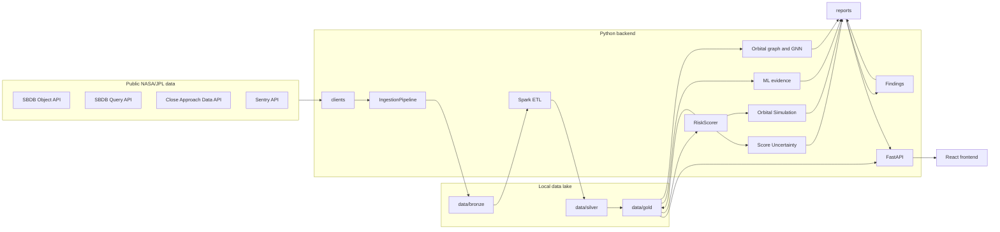
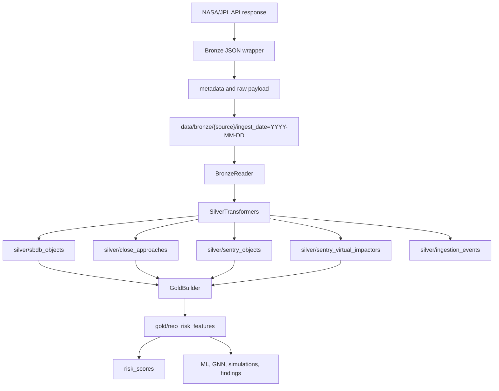
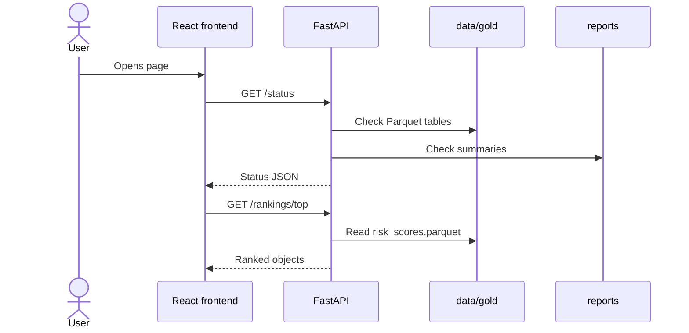

# INSTALACIÓN

Esta sección instala Neo Angele Risk Lab desde cero en Ubuntu, Debian o Linux Mint. La primera construcción puede tardar porque Docker descarga imágenes, instala dependencias de Python, PySpark, scikit-learn, Node, paquetes del frontend y porque algunos artefactos de datos o reportes pueden generarse por primera vez. Ese tiempo inicial es normal.

URLs del proyecto levantado:

- Frontend: http://127.0.0.1:5174
- API: http://127.0.0.1:8000

## Instalación completa en Linux

Copiar y pegar este bloque en una terminal. En Linux Mint se usa el repositorio de Docker para Ubuntu con el codename de Ubuntu subyacente.

```bash
sudo apt-get update
sudo apt-get upgrade -y
sudo apt-get install -y git curl ca-certificates gnupg lsb-release

sudo install -m 0755 -d /etc/apt/keyrings

if [ -f /etc/linuxmint/info ]; then
  . /etc/os-release
  UBUNTU_CODENAME="${UBUNTU_CODENAME:-$(. /etc/linuxmint/info && echo "$UBUNTU_CODENAME")}"
  curl -fsSL https://download.docker.com/linux/ubuntu/gpg | sudo gpg --dearmor -o /etc/apt/keyrings/docker.gpg
  echo "deb [arch=$(dpkg --print-architecture) signed-by=/etc/apt/keyrings/docker.gpg] https://download.docker.com/linux/ubuntu ${UBUNTU_CODENAME} stable" | sudo tee /etc/apt/sources.list.d/docker.list > /dev/null
elif . /etc/os-release && [ "$ID" = "debian" ]; then
  curl -fsSL https://download.docker.com/linux/debian/gpg | sudo gpg --dearmor -o /etc/apt/keyrings/docker.gpg
  echo "deb [arch=$(dpkg --print-architecture) signed-by=/etc/apt/keyrings/docker.gpg] https://download.docker.com/linux/debian $(. /etc/os-release && echo "$VERSION_CODENAME") stable" | sudo tee /etc/apt/sources.list.d/docker.list > /dev/null
else
  curl -fsSL https://download.docker.com/linux/ubuntu/gpg | sudo gpg --dearmor -o /etc/apt/keyrings/docker.gpg
  echo "deb [arch=$(dpkg --print-architecture) signed-by=/etc/apt/keyrings/docker.gpg] https://download.docker.com/linux/ubuntu $(. /etc/os-release && echo "${UBUNTU_CODENAME:-$VERSION_CODENAME}") stable" | sudo tee /etc/apt/sources.list.d/docker.list > /dev/null
fi

sudo chmod a+r /etc/apt/keyrings/docker.gpg
sudo apt-get update
sudo apt-get install -y docker-ce docker-ce-cli containerd.io docker-buildx-plugin docker-compose-plugin

sudo usermod -aG docker "$USER"
newgrp docker

docker --version
docker compose version
docker run --rm hello-world

git clone https://github.com/LiamSalazar/NEO-Angele-Risk-Lab.git
cd NEO-Angele-Risk-Lab

docker compose up -d --build app frontend
docker compose ps

curl http://127.0.0.1:8000/health
curl http://127.0.0.1:8000/status
```

Abrir en el navegador:

- http://127.0.0.1:5174
- http://127.0.0.1:8000

Para bajar servicios:

```bash
docker compose down
```

## Comandos rápidos si Docker ya está instalado

```bash
git clone https://github.com/LiamSalazar/NEO-Angele-Risk-Lab.git
cd NEO-Angele-Risk-Lab
docker compose up -d --build app frontend
docker compose ps
curl http://127.0.0.1:8000/health
```

Para iniciar sin reconstruir:

```bash
docker compose up -d --no-build app frontend
```

Para reconstruir:

```bash
docker compose build app frontend
docker compose up -d app frontend
```

## Validación de API y frontend

```bash
curl http://127.0.0.1:8000/health
curl http://127.0.0.1:8000/status
curl -I http://127.0.0.1:5174
docker compose ps
```

## Solución de problemas comunes

### Permisos de Docker

Error típico: `permission denied while trying to connect to the Docker daemon socket`.

```bash
sudo usermod -aG docker "$USER"
newgrp docker
docker run --rm hello-world
```

Si el error continúa, cerrar sesión y volver a entrar.

### Solo levantó frontend y no backend

```bash
docker compose ps -a
docker compose logs -f app
docker compose up -d app frontend
curl http://127.0.0.1:8000/health
```

### Se canceló `docker compose build`

```bash
docker compose build app frontend
docker compose up -d app frontend
```

### `image not found`

```bash
docker compose build --no-cache app frontend
docker compose up -d app frontend
```

### Puerto ocupado

```bash
sudo ss -ltnp | grep ':8000\|:5174'
docker compose down
docker compose up -d app frontend
```

Si otro programa usa el puerto, detener ese programa o cambiar el mapeo de puertos en `docker-compose.yml`.

### Backend no responde

```bash
docker compose ps -a
docker compose logs -f app
docker compose restart app
curl http://127.0.0.1:8000/health
```

### `model_predictions_full.parquet` no existe

```bash
docker compose exec -T app python -m neo_ange.cli model-evidence build
ls -lah reports/model_evidence/
```

### Evidence no cubre 4,000 `object_key`

Validar cobertura real antes de interpretar la evidencia:

```bash
docker compose exec -T app python - <<'EOF'
import pandas as pd
from pathlib import Path

path = Path("reports/model_evidence/model_predictions_full.parquet")
print("exists:", path.exists())
if path.exists():
    df = pd.read_parquet(path)
    print("rows:", len(df))
    print("unique_object_key:", df["object_key"].astype(str).nunique())
    print(df["model_name"].value_counts(dropna=False))
EOF
```

### Reports viejos

Regenerar reportes principales:

```bash
docker compose exec -T app python -m neo_ange.cli risk build
docker compose exec -T app python -m neo_ange.cli model-evidence build
docker compose exec -T app python -m neo_ange.cli findings build
```

### Logs del backend y frontend

```bash
docker compose logs -f app
docker compose logs -f frontend
```

### Reconstrucción de app

```bash
docker compose build app
docker compose build frontend
docker compose up -d app frontend
```

### Validación de `data/gold` y `reports/model_evidence`

```bash
docker compose exec -T app python - <<'EOF'
import pandas as pd
from pathlib import Path

paths = [
    "data/gold/neo_risk_features",
    "data/gold/risk_scores",
    "reports/model_evidence/model_predictions_full.parquet",
]

for p in paths:
    path = Path(p)
    print("\n===", p, "===")
    print("exists:", path.exists())
    if path.exists():
        df = pd.read_parquet(path)
        print("rows:", len(df))
        if "object_key" in df.columns:
            print("unique_object_key:", df["object_key"].astype(str).nunique())
        print("columns:", list(df.columns)[:30])
EOF
```

### Primera ejecución lenta

La primera ejecución puede tardar por descarga de imágenes, instalación de dependencias científicas, construcción del frontend, PySpark, PyTorch opcional, lectura de Parquet, ingesta, generación de reportes o creación de artefactos. Una vez construidas las imágenes, los siguientes arranques suelen ser más rápidos.

# DOCUMENTATION

# Neo Angele Risk Lab

Neo Angele Risk Lab is a data engineering, experimental risk analytics, and visualization lab for studying Near-Earth Objects, or NEOs, using public NASA/JPL data.

The project downloads data from public APIs, preserves it in a bronze layer, normalizes it with PySpark into silver, builds a gold dataset, calculates an explainable Risk Priority Score, generates rankings, runs score uncertainty propagation and sensitivity analysis, builds an orbital graph, produces secondary evidence with machine learning models, and exposes results through FastAPI and a React frontend.

## Problem Addressed

NEO data exists in public sources, but it is usually spread across different APIs, formats, and tables. This project organizes those sources into a reproducible flow to answer analytical questions such as:

- which objects have the highest review priority inside this lab;
- which variables explain that priority;
- how stable the score is under approximate perturbations;
- which objects have similar orbital neighborhoods;
- where secondary-evidence models agree or disagree.

The system does not predict impacts and does not issue official alerts. Its value is in technical integration, data traceability, score explainability, and educational visualization.

## What Is a NEO

A NEO, or Near-Earth Object, is a small Solar System object whose orbit brings it close to Earth's orbital region. This project mainly works with asteroids and fields such as absolute magnitude `h`, diameter, MOID, orbital elements, close approaches, and Sentry signals when available.

## What This Is Not

Neo Angele Risk Lab is not an official alerting system, and it does not replace NASA/JPL, CNEOS, Sentry, or professional orbital analysis. The Risk Priority Score is an experimental analytical priority from 0 to 100 for ordering review inside this repository.

## Final Project State

This checkout contains the following implemented capabilities:

- Clients for the SBDB Object API, SBDB Query API, Close Approach Data API, and Sentry API.
- Ingestion into `data/bronze` with source metadata, parameters, object id, API signature, and UTC time.
- Bronze/silver/gold ETL with PySpark and Parquet writes.
- Gold dataset at `data/gold/neo_risk_features`.
- Risk Priority Score and ranking at `data/gold/risk_scores`.
- Per-object explanations and categories: `low`, `moderate`, `elevated`, `high`, `critical`.
- Score Simulation through uncertainty propagation and tabular sensitivity analysis.
- Orbital Simulation through approximate orbital clones.
- kNN orbital graph and GNN lab.
- Model evidence, model cards, eval/full predictions, and disagreements.
- Analytical findings in `reports/findings`.
- FastAPI API.
- React/TypeScript/Vite frontend.
- Docker Compose for running the API and frontend.

## Overall Architecture

The source diagram lives in [`docs/diagrams/system_architecture.mmd`](docs/diagrams/system_architecture.mmd).


```mermaid
flowchart LR
    subgraph Sources["Public NASA/JPL data"]
        SBDBObject["SBDB Object API"]
        SBDBQuery["SBDB Query API"]
        CAD["Close Approach Data API"]
        Sentry["Sentry API"]
    end
    subgraph Backend["Python backend"]
        Clients["clients"]
        Ingestion["IngestionPipeline"]
        ETL["Spark ETL"]
        Risk["RiskScorer"]
        ScoreMC["Score Uncertainty"]
        OrbitalMC["Orbital Simulation"]
        ML["ML evidence"]
        GNN["Orbital graph and GNN"]
        Findings["Findings"]
        API["FastAPI"]
    end
    subgraph Lake["Local data lake"]
        Bronze["data/bronze"]
        Silver["data/silver"]
        Gold["data/gold"]
    end
    Reports["reports"]
    Frontend["React frontend"]
    Sources --> Clients --> Ingestion --> Bronze --> ETL --> Silver --> Gold
    Gold --> Risk --> Gold
    Risk --> ScoreMC --> Reports
    Risk --> OrbitalMC --> Reports
    Gold --> ML --> Reports
    Gold --> GNN --> Reports
    Reports --> Findings --> Reports
    Gold --> API
    Reports --> API
    API --> Frontend
```

## Bronze, Silver, and Gold Data Flow

The source diagram lives in [`docs/diagrams/data_pipeline_bronze_silver_gold.mmd`](docs/diagrams/data_pipeline_bronze_silver_gold.mmd).


```mermaid
flowchart TD
    A["NASA/JPL API response"] --> B["Bronze JSON wrapper"]
    B --> C["metadata and raw payload"]
    C --> D["data/bronze/{source}/ingest_date=YYYY-MM-DD"]
    D --> E["BronzeReader"]
    E --> F["SilverTransformers"]
    F --> G1["silver/sbdb_objects"]
    F --> G2["silver/close_approaches"]
    F --> G3["silver/sentry_objects"]
    F --> G4["silver/sentry_virtual_impactors"]
    F --> G5["silver/ingestion_events"]
    G1 --> H["GoldBuilder"]
    G2 --> H
    G3 --> H
    G4 --> H
    H --> I["gold/neo_risk_features"]
    I --> J["risk_scores"]
    I --> K["ML, GNN, simulations, findings"]
```

## Data Sources Used

| Source | Endpoint | Client | Main use |
| --- | --- | --- | --- |
| SBDB Object API | `https://ssd-api.jpl.nasa.gov/sbdb.api` | `src/neo_ange/clients/sbdb_object.py` | Rich per-object data: identity, physical data, orbit, close approaches, and auxiliary data. |
| SBDB Query API | `https://ssd-api.jpl.nasa.gov/sbdb_query.api` | `src/neo_ange/clients/sbdb_query.py` | Tabular queries and object discovery. |
| Close Approach Data API | `https://ssd-api.jpl.nasa.gov/cad.api` | `src/neo_ange/clients/close_approach.py` | Close approaches, distance, velocity, and date. |
| Sentry API | `https://ssd-api.jpl.nasa.gov/sentry.api` | `src/neo_ange/clients/sentry.py` | Sentry risk signals, probabilities, Palermo/Torino scales, and virtual impactors when available. |

Private API keys are not required.

## Folder Structure

| Path | Purpose |
| --- | --- |
| `src/neo_ange/clients` | HTTP clients for NASA/JPL APIs. |
| `src/neo_ange/pipelines` | Ingestion, ETL, ML, risk, and simulation orchestration. |
| `src/neo_ange/services` | Bronze, silver, and gold layer resolution and writes. |
| `src/neo_ange/etl` | Bronze reading, silver transformations, gold builder, quality checks, and writers. |
| `src/neo_ange/risk` | Score, categories, ranking, explanations, and reports. |
| `src/neo_ange/simulation` | Score uncertainty propagation and sensitivity analysis. |
| `src/neo_ange/orbital_simulation` | Approximate clone-based orbital simulation. |
| `src/neo_ange/ml` | Feature sets, baselines, metrics, and leakage audit. |
| `src/neo_ange/evidence` | Model evidence, model cards, predictions, and disagreements. |
| `src/neo_ange/gnn` | Orbital graph, datasets, baselines, optional GraphSAGE/GCN, and reports. |
| `src/neo_ange/findings` | Analytical findings for API/frontend. |
| `src/neo_ange/api` | FastAPI, routers, and schemas. |
| `frontend` | App React/TypeScript/Vite. |
| `data/bronze` | Raw JSON wrapped with metadata. |
| `data/silver` | Normalized Parquet tables. |
| `data/gold` | Features, risk scores, simulations, and graph. |
| `reports` | JSON/CSV/Markdown summaries. |
| `artifacts` | Generated models, screenshots, and artifacts. |
| `docs` | Technical documentation and diagrams. |
| `tests` | Unit tests and local integration tests. |

## Object-Oriented Programming

Neo Angele Risk Lab uses object-oriented design to transform NASA/JPL records into explicit domain concepts. The domain model was not created by simply splitting a CSV or copying dataset columns into classes. Instead, the project interprets the incoming NASA/JPL data as a structured representation of a Near-Earth Object and separates that representation into cohesive objects with clear responsibilities.

The central abstraction is `Asteroid`, which acts as the aggregate root of the pure domain model. It groups the object identity, orbital elements, physical properties, close-approach context and Sentry-related signal into a single coherent representation. Each component encapsulates data and behavior related to one part of the domain:

- `AsteroidIdentity` stores stable identifiers, designations, display names and orbit-class labels.
- `Orbit` encapsulates orbital elements and provides orbital indicators such as proximity and uncertainty.
- `PhysicalProperties` encapsulates magnitude, diameter, albedo and size-related indicators.
- `CloseApproachSummary` summarizes close-approach records derived from CAD data.
- `SentryRiskSignal` groups Sentry-related impact-probability and Palermo/Torino-style signals when available.

`CloseApproachSummary` is intentionally modeled as a summary object. It is related conceptually to individual `CloseApproach` records because it summarizes CAD observations, but it does not strongly compose a stored list of those records in the current code.

This design keeps the domain language explicit. The project can still use tabular processing for performance in the ETL pipeline, but the object-oriented layer provides a clearer conceptual model for interpretation, testing, API responses, documentation and extension.

The following UML image shows only the pure domain abstraction. It intentionally excludes process classes such as factories, repositories, scorers, simulations, builders, pipelines, API clients, ML/GNN components and reporters. Those classes are documented separately because they describe how the system processes the domain objects, not the domain abstraction itself.


Source: [`docs/diagrams/class_diagram_entities.mmd`](docs/diagrams/class_diagram_entities.mmd)

Additional UML documentation:

- [Pure domain class diagram](docs/diagrams/class_diagram_entities.mmd)
- [System class diagram](docs/diagrams/class_diagram_system.mmd)
- [README summary class diagram](docs/diagrams/class_diagram_readme_summary.mmd)
- [Object-oriented design notes](docs/object_oriented_design.md)

## Risk Priority Score

The ranking is not built by the models. The ranking is built with `RiskScorer` in `src/neo_ange/risk/scoring.py`.

General formula:

```text
R = sum(w_i * C_i)
R_100 = 100 * R
```

Where `C_i` is each normalized component in the `[0, 1]` range, `w_i` is its weight, and the sum of weights is 1.

Actual weights in `src/neo_ange/risk/schemas.py`:

| Component | Weight |
| --- | ---: |
| `physical_risk_component` | 0.22 |
| `orbital_risk_component` | 0.25 |
| `approach_risk_component` | 0.18 |
| `sentry_risk_component` | 0.17 |
| `uncertainty_risk_component` | 0.13 |
| `data_quality_component` | 0.05 |

Actual components:

- `physical_risk_component`: diameter, `h`, `log_diameter`, `size_proxy_score`.
- `orbital_risk_component`: `moid`, `moid_ld`, `inverse_moid`, `q`, `e`, `i`.
- `approach_risk_component`: minimum distance, nominal minimum distance, relative velocity, close-approach count, and inverse distance.
- `sentry_risk_component`: `sentry_flag`, Sentry presence, `sentry_ip`, cumulative/maximum Palermo, maximum Torino, and number of virtual impacts.
- `uncertainty_risk_component`: `condition_code`, `rms`, observation arc, number of observations, and uncertainty proxy.
- `data_quality_component`: feature incompleteness, short arc, and low number of observations.

Actual helper functions:

```text
bounded(x) = min(max(x, 0), 1)
weighted_available = weighted average of available signals only
probability_signal(p) = bounded((log10(p) + 10) / 10)
palermo_signal(x) = bounded((x + 8) / 10)
```

Actual categories in `src/neo_ange/risk/categories.py`:

| Category | Range |
| --- | --- |
| `low` | `0 <= score < 20` |
| `moderate` | `20 <= score < 40` |
| `elevated` | `40 <= score < 60` |
| `high` | `60 <= score < 80` |
| `critical` | `score >= 80` |

## Simulations

### Score Simulation

Score Simulation lives in `src/neo_ange/simulation`. It perturbs tabular variables that feed the Risk Priority Score and recalculates the score many times. It does not propagate orbits and does not estimate an official impact probability.

Actual perturbed variables:

```text
diameter, h, moid, moid_ld,
min_close_approach_dist, min_close_approach_dist_min,
max_close_approach_v_rel,
sentry_ip, sentry_ps_cum,
condition_code, rms, arc_length, n_obs_used
```

It produces `base_score`, `mean_score`, `std_score`, `p05_score`, `median_score`, `p95_score`, `probability_score_above_60`, `probability_score_above_80`, and `category_shift_probability`.

### Orbital Simulation

Orbital Simulation lives in `src/neo_ange/orbital_simulation`. It generates approximate orbital clones from elements such as `a`, `e`, `i`, `om`, `w`, `ma`, `n`, `per`, `moid`, `condition_code`, `arc_length`, `n_obs_used`, and `rms`.

It uses a simplified heliocentric two-body propagation, solves Kepler with Newton iterations, approximates Earth as a circular 1 AU orbit, and summarizes Earth-object distances.

It produces `baseline_min_distance_au`, mean and percentiles of simulated minimum distance, day of closest approach, `dispersion_index`, `orbital_uncertainty_score`, and categories `stable`, `variable`, `needs_review`, `uncertain`.

## Machine Learning and Model Evidence

Models do not define the ranking. Models provide secondary evidence to review consistency, disagreements, and possible patterns. The main ranking comes from the Risk Priority Score.

Actual tabular models:

- `dummy_most_frequent`
- `logistic_regression`
- `random_forest`
- `hist_gradient_boosting`
- `rule_based_pha`

GNN lab baselines:

- `logistic_regression`
- `random_forest`
- `mlp`
- `label_propagation`

Optional GNN models:

- `GraphSAGE`
- `GCN`

`torch` and `torch-geometric` are optional dependencies from the `gnn` extra. `torchmetrics` does not appear as a dependency and is not used to calculate metrics; metrics are calculated with `scikit-learn` in `src/neo_ange/ml/metrics.py`.

Actual feature sets:

- `full_features`
- `definition_features_only`
- `no_definition_features`
- `orbital_only`
- `approach_and_quality`
- `sentry_related`
- `graph_node_features` in the GNN lab.

The system separates evaluation predictions from full-inference predictions:

- `reports/model_evidence/model_predictions_eval.parquet`
- `reports/model_evidence/model_predictions_full.parquet`

## Orbital Graph and GNN

The orbital graph connects objects by k-nearest-neighbor similarity over numeric orbital and context features. Identifiers and the direct target are excluded. The graph is stored in:

- `data/gold/gnn_graph/nodes.parquet`
- `data/gold/gnn_graph/edges.parquet`
- `reports/gnn/graph_summary.json`
- `reports/gnn/gnn_metrics.csv`

The source diagram lives in [`docs/diagrams/gnn_orbital_graph_flow.mmd`](docs/diagrams/gnn_orbital_graph_flow.mmd).

## API and Frontend

The backend is built with FastAPI and is imported as `neo_ange.api.main:app`. The frontend lives in `frontend` and uses React, TypeScript, Vite, TanStack Query, ECharts, Framer Motion, Lucide, and Three.js.

Main screens:

- Control Panel: overall system status and telemetry.
- Risk Ranking: objects ordered by Risk Priority Score.
- Object Profile: per-object profile, components, evidence, and neighbors.
- Score Simulation: score stability under tabular perturbation.
- Orbital Simulation: approximate orbital scenarios.
- Orbital Graph: graph, neighbors, and GNN/baseline metrics.
- Findings: aggregated analytical findings.
- Methodology: methodology and technical notes.


```mermaid
sequenceDiagram
    actor User
    participant Frontend as React frontend
    participant API as FastAPI
    participant Gold as data/gold
    participant Reports as reports
    User->>Frontend: Opens page
    Frontend->>API: GET /status
    API->>Gold: Check Parquet tables
    API->>Reports: Check summaries
    API-->>Frontend: Status JSON
    Frontend->>API: GET /rankings/top
    API->>Gold: Read risk_scores.parquet
    API-->>Frontend: Ranked objects
```

Main endpoints:

| Endpoint | Purpose |
| --- | --- |
| `GET /health` | Basic API health. |
| `GET /status` | Data, report, and manifest status. |
| `GET /objects` | Paginated object list. |
| `GET /objects/{object_key}` | Tabular profile for one object. |
| `GET /rankings/top` | Ranking by Risk Priority Score. |
| `GET /rankings/summary` | Ranking statistics. |
| `POST /risk/build` | Recalculate scores. |
| `GET /risk/explain/{object_key}` | Per-object score explanation. |
| `POST /simulations/batch` | Batch score uncertainty propagation. |
| `GET /orbital-simulation/status` | Orbital simulation status. |
| `POST /orbital-simulation/batch` | Batch orbital simulation. |
| `GET /gnn/status` | Graph and GNN dependency status. |
| `GET /gnn/graph` | Graph nodes and edges. |
| `GET /findings/summary` | Aggregated findings. |
| `GET /model-evidence/summary` | Model evidence summary. |

## Actual Results Included in This Checkout

These numbers were read from existing files in this repository. When reports do not match each other, the difference is documented in the table.

| Artifact | Observed result |
| --- | --- |
| `data/gold/neo_risk_features` | 1,000 rows; 280 `pha=true`; 720 `pha=false`. |
| `data/gold/risk_scores/risk_scores.parquet` | 1,000 rows; `low=70`, `moderate=909`, `elevated=21`. |
| `reports/risk/risk_scores_summary.json` | Min score 14.389905; mean 28.766260; median 29.164740; max 47.271572. |
| Top object from the risk summary | `20152637`, `152637 (1997 NC1)`, score 47.271572, category `elevated`. |
| `data/gold/simulation_results/monte_carlo_results.parquet` | 21 Score Simulation rows. |
| `reports/simulation/monte_carlo_summary.json` | `n_result_rows=21`, version `monte-carlo-v0.1.0`. |
| `data/gold/orbital_simulation/orbital_monte_carlo_results.parquet` | 50 rows; `stable=16`, `variable=21`, `needs_review=8`, `uncertain=5`. |
| `reports/orbital_simulation/orbital_simulation_summary.json` | Min p05 distance 0.020102 AU; mean dispersion 0.617105. |
| `data/gold/gnn_graph/nodes.parquet` | 1,000 nodes. |
| `data/gold/gnn_graph/edges.parquet` | 6,955 edges. |
| `reports/gnn/graph_summary.json` | Density 0.0139239; status `success`. |
| `reports/gnn/gnn_metrics.csv` | 14 metric rows; GraphSAGE and GCN appear as `skipped_missing_dependency` in this CSV. |
| `reports/model_evidence/model_evidence_summary.json` | Reports 20,000 full predictions, 5,000 eval predictions, coverage 1.0, 1,367 disagreements, and best GraphSAGE evidence; this report corresponds to a 4,000-object run and does not match the current 1,000-object Parquet files. |
| `reports/findings/findings_summary.json` | Also reflects a 4,000-object run; regenerate it if you want it aligned with the current `data/gold` state. |

Important limitation: this checkout contains artifacts from different runs. For a fully coherent final snapshot, run the full regeneration and then `model-evidence build` and `findings build`.

## Run with Docker

```bash
docker compose up -d --build
```

Local URLs:

```text
API: http://127.0.0.1:8000
Frontend: http://127.0.0.1:5174
```

Validate:

```bash
curl http://127.0.0.1:8000/health
curl http://127.0.0.1:8000/status
curl http://127.0.0.1:8000/findings/summary
curl http://127.0.0.1:8000/model-evidence/summary
curl http://127.0.0.1:8000/orbital-simulation/status
```

## Regenerate Dataset and Reports

This flow can take from one to several hours depending on the machine, network, and dependencies.

```bash
docker compose exec app python -m neo_ange.cli expand max --target 4000 --skip-existing --resume
docker compose exec app python -m neo_ange.cli etl run-all
docker compose exec app python -m neo_ange.cli risk build
docker compose exec app python -m neo_ange.cli simulate batch --limit 100 --n-simulations 500
docker compose exec app python -m neo_ange.cli orbital-sim batch --limit 50 --n-clones 300 --horizon-days 3650 --time-step-days 10
docker compose exec app python -m neo_ange.cli ml run-all --target pha
docker compose exec app python -m neo_ange.cli gnn build-graph --k 10 --min-nodes 100
docker compose exec app python -m neo_ange.cli gnn run --target pha --k 10 --min-nodes 100
docker compose exec app python -m neo_ange.cli model-evidence build
docker compose exec app python -m neo_ange.cli findings build
```

## Development Validation

```bash
python -m pytest
python -m ruff check .
python -m black --check .
```

## Methodology Document

The technical report is in:

- [`docs/methodology/neo_ange_methodology.tex`](docs/methodology/neo_ange_methodology.tex)
- [`docs/methodology/build_pdf.md`](docs/methodology/build_pdf.md)
- [`docs/methodology/README.md`](docs/methodology/README.md)

If you have LaTeX installed:

```bash
cd docs/methodology
pdflatex neo_ange_methodology.tex
```

There is also an optional script:

```bash
bash scripts/build_methodology_pdf.sh
```

## Diagrams

The Mermaid diagrams created for this documentation are in:

- [`docs/diagrams/system_architecture.mmd`](docs/diagrams/system_architecture.mmd)
- [`docs/diagrams/data_pipeline_bronze_silver_gold.mmd`](docs/diagrams/data_pipeline_bronze_silver_gold.mmd)
- [`docs/diagrams/class_diagram_domain.mmd`](docs/diagrams/class_diagram_domain.mmd)
- [`docs/diagrams/risk_scoring_flow.mmd`](docs/diagrams/risk_scoring_flow.mmd)
- [`docs/diagrams/ml_model_evidence_flow.mmd`](docs/diagrams/ml_model_evidence_flow.mmd)
- [`docs/diagrams/gnn_orbital_graph_flow.mmd`](docs/diagrams/gnn_orbital_graph_flow.mmd)
- [`docs/diagrams/score_monte_carlo_flow.mmd`](docs/diagrams/score_monte_carlo_flow.mmd)
- [`docs/diagrams/orbital_simulation_flow.mmd`](docs/diagrams/orbital_simulation_flow.mmd)
- [`docs/diagrams/api_frontend_sequence.mmd`](docs/diagrams/api_frontend_sequence.mmd)
- [`docs/diagrams/final_app_navigation.mmd`](docs/diagrams/final_app_navigation.mmd)

## Honest Limitations

- The score is experimental and educational.
- Missing Sentry data does not mean zero risk; it means no Sentry signal is available in that row.
- Orbital simulation is approximate and does not replace professional propagation.
- Models can learn PHA definitions when they use `h`, `moid`, diameter, or close proxies.
- Some reports in this checkout belong to different runs and should be regenerated for a single final snapshot.
- Data coverage depends on public API availability and local execution.

## Minimal Optional Roadmap

- Publish a stable read-only deployment.
- Regenerate all artifacts from scratch in a single audited run.
- Improve frontend performance for large graphs.
- Keep the English documentation aligned with future changes.

## Installation Guide from Scratch

This guide is practical and copyable. It does not assume you already have Git, Docker, or Docker Compose.

### Installation on Linux Ubuntu/Debian/Linux Mint

#### 1. Update Packages

```bash
sudo apt update
sudo apt upgrade -y
```

#### 2. Install Git, curl, and Basic Dependencies

```bash
sudo apt install -y git curl ca-certificates gnupg lsb-release
```

#### 3. Install Docker

```bash
sudo install -m 0755 -d /etc/apt/keyrings
curl -fsSL https://download.docker.com/linux/ubuntu/gpg | sudo gpg --dearmor -o /etc/apt/keyrings/docker.gpg
sudo chmod a+r /etc/apt/keyrings/docker.gpg
```

Add the Docker repository:

```bash
echo \
  "deb [arch=$(dpkg --print-architecture) signed-by=/etc/apt/keyrings/docker.gpg] https://download.docker.com/linux/ubuntu \
  $(. /etc/os-release && echo "$VERSION_CODENAME") stable" | \
  sudo tee /etc/apt/sources.list.d/docker.list > /dev/null
```

Install Docker:

```bash
sudo apt update
sudo apt install -y docker-ce docker-ce-cli containerd.io docker-buildx-plugin docker-compose-plugin
```

#### 4. Allow Docker Usage Without sudo

```bash
sudo usermod -aG docker $USER
```

Sign out and back in, or restart the computer, so the `docker` group change takes effect.

Temporary alternative command:

```bash
newgrp docker
```

#### 5. Validate Docker

```bash
docker --version
docker compose version
docker run hello-world
```

#### 6. Clone the Repository

```bash
git clone https://github.com/LiamSalazar/NEO-Angele-Risk-Lab.git
cd NEO-Angele-Risk-Lab
```

#### 7. Start the Application

```bash
docker compose up -d --build
```

#### 8. Validate That Containers Are Running

```bash
docker compose ps
```

You should see services similar to:

```text
neo_ange_api        Up
neo_ange_frontend   Up
```

#### 9. Validate the API

```bash
curl http://127.0.0.1:8000/health
curl http://127.0.0.1:8000/status
```

#### 10. Open the Application

Open your browser and enter this in the address bar:

```text
http://127.0.0.1:5174
```

That is the project's web interface.

### Regenerate Dataset, Models, Simulations, and Findings

This step can take from one to several hours depending on the computer and internet connection.

```bash
docker compose exec app python -m neo_ange.cli expand max --target 4000 --skip-existing --resume
docker compose exec app python -m neo_ange.cli etl run-all
docker compose exec app python -m neo_ange.cli risk build
docker compose exec app python -m neo_ange.cli simulate batch --limit 100 --n-simulations 500
docker compose exec app python -m neo_ange.cli orbital-sim batch --limit 50 --n-clones 300 --horizon-days 3650 --time-step-days 10
docker compose exec app python -m neo_ange.cli ml run-all --target pha
docker compose exec app python -m neo_ange.cli gnn build-graph --k 10 --min-nodes 100
docker compose exec app python -m neo_ange.cli gnn run --target pha --k 10 --min-nodes 100
docker compose exec app python -m neo_ange.cli model-evidence build
docker compose exec app python -m neo_ange.cli findings build
```

#### 12. Validate Generated Results

```bash
curl http://127.0.0.1:8000/findings/summary
curl http://127.0.0.1:8000/model-evidence/summary
curl http://127.0.0.1:8000/orbital-simulation/status
curl http://127.0.0.1:8000/gnn/status
```

#### 13. Shut Down the App

```bash
docker compose down
```

#### 14. Start It Again Later

```bash
cd NEO-Angele-Risk-Lab
docker compose up -d
```

Open again:

```text
http://127.0.0.1:5174
```

### Installation on macOS

On macOS, using Homebrew and Docker Desktop is recommended.

#### 1. Install Homebrew if Needed

```bash
/bin/bash -c "$(curl -fsSL https://raw.githubusercontent.com/Homebrew/install/HEAD/install.sh)"
```

#### 2. Install Git

```bash
brew install git
```

#### 3. Install Docker Desktop

```bash
brew install --cask docker
```

After installing Docker Desktop, open the Docker app from Launchpad or Applications and wait until it appears as "running".

#### 4. Validate Docker

```bash
docker --version
docker compose version
```

#### 5. Clone the Repository

```bash
git clone https://github.com/LiamSalazar/NEO-Angele-Risk-Lab.git
cd NEO-Angele-Risk-Lab
```

#### 6. Start the Application

```bash
docker compose up -d --build
```

#### 7. Validate Services

```bash
docker compose ps
```

#### 8. Validate the API

```bash
curl http://127.0.0.1:8000/health
curl http://127.0.0.1:8000/status
```

#### 9. Open the Interface

Open Safari, Chrome, or Firefox and enter:

```text
http://127.0.0.1:5174
```

#### 10. Regenerate Data

```bash
docker compose exec app python -m neo_ange.cli expand max --target 4000 --skip-existing --resume
docker compose exec app python -m neo_ange.cli etl run-all
docker compose exec app python -m neo_ange.cli risk build
docker compose exec app python -m neo_ange.cli simulate batch --limit 100 --n-simulations 500
docker compose exec app python -m neo_ange.cli orbital-sim batch --limit 50 --n-clones 300 --horizon-days 3650 --time-step-days 10
docker compose exec app python -m neo_ange.cli ml run-all --target pha
docker compose exec app python -m neo_ange.cli gnn build-graph --k 10 --min-nodes 100
docker compose exec app python -m neo_ange.cli gnn run --target pha --k 10 --min-nodes 100
docker compose exec app python -m neo_ange.cli model-evidence build
docker compose exec app python -m neo_ange.cli findings build
```

#### 11. Shut Down the App

```bash
docker compose down
```

### Common Problems

#### Docker Is Not Started

```text
Error: Cannot connect to the Docker daemon
```

On Linux:

```bash
sudo systemctl start docker
sudo systemctl enable docker
```

On macOS: open Docker Desktop.

#### Port in Use

If port 5174 or 8000 is in use:

```bash
docker compose down
docker compose up -d
```

If it persists:

```bash
sudo lsof -i :5174
sudo lsof -i :8000
```

#### Permission Denied in Docker

```text
permission denied while trying to connect to the Docker daemon
```

Solution:

```bash
sudo usermod -aG docker $USER
newgrp docker
```

#### The App Opens but Shows Little Data

Regenerate the data:

```bash
docker compose exec app python -m neo_ange.cli expand max --target 4000 --skip-existing --resume
docker compose exec app python -m neo_ange.cli etl run-all
docker compose exec app python -m neo_ange.cli risk build
docker compose exec app python -m neo_ange.cli model-evidence build
docker compose exec app python -m neo_ange.cli findings build
```

#### The Frontend Does Not Load

```bash
docker compose ps
curl -I http://127.0.0.1:5174
```

#### The API Does Not Respond

```bash
docker compose logs app --tail=100
```

#### The Frontend Does Not Reflect Changes

```text
Reload with Ctrl + Shift + R.
```

On macOS:

```text
Command + Shift + R.
```

If everything completed correctly, the application will be available at:

```text
http://127.0.0.1:5174
```
